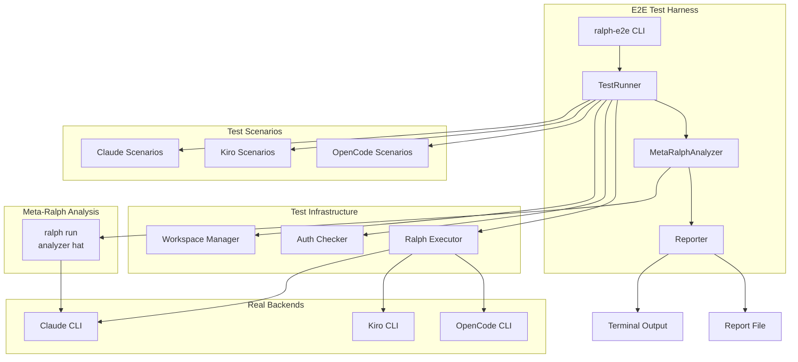
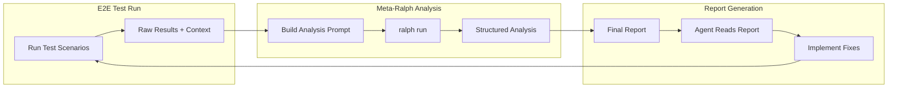
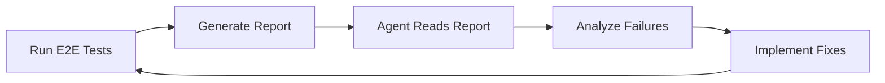
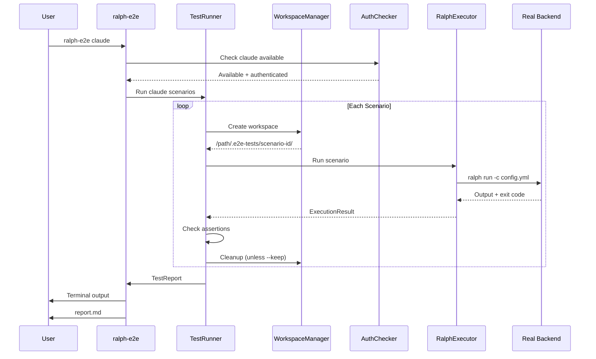
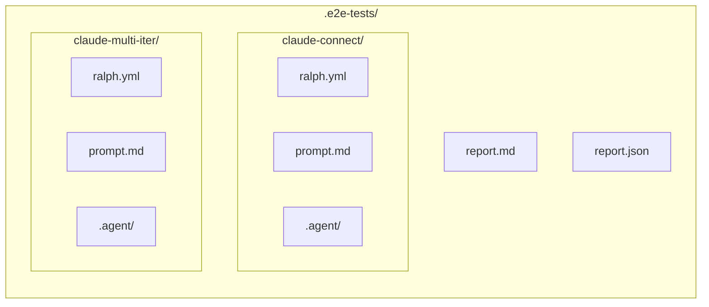

# E2E Test Harness - Detailed Design

## Overview

This document describes the design for an end-to-end (E2E) test harness that validates Ralph orchestrator functionality against real AI backends. The harness enables developers to verify that Ralph works correctly with Claude, Kiro, and OpenCode before releases.

**Key Principle:** Following the [writing-skills TDD methodology](https://github.com/obra/superpowers/tree/main/skills/writing-skills), this harness applies skill verification principles to validate Ralph's behavior.

### Writing-Skills Principles Applied

| Principle | Application in E2E Harness |
|-----------|---------------------------|
| **TDD for Documentation** | Each test scenario = pressure scenario for Ralph |
| **RED Phase (Baseline)** | Document what fails without proper config |
| **GREEN Phase (Compliance)** | Verify correct behavior with proper config |
| **REFACTOR Phase (Loopholes)** | Close edge cases discovered during testing |
| **Rationalization Tables** | Meta-Ralph identifies agent excuses vs reality |
| **One Excellent Test** | Deep scenarios over many shallow ones |
| **Pressure Testing** | Test under combined pressures (time + complexity) |
| **Explicit Loophole Closing** | Add tests for every discovered failure mode |

---

## Detailed Requirements

### Functional Requirements

| ID | Requirement | Priority |
|----|-------------|----------|
| FR1 | Invoke `ralph run` with real Claude backend | Must |
| FR2 | Invoke `ralph run` with real Kiro backend | Must |
| FR3 | Invoke `ralph run` with real OpenCode backend | Must |
| FR4 | Validate basic prompt/response cycle | Must |
| FR5 | Validate full orchestration loop (multi-iteration) | Must |
| FR6 | Validate event parsing from agent output | Must |
| FR7 | Validate tool use end-to-end | Should |
| FR8 | Validate streaming output (Claude NDJSON) | Should |
| FR9 | Validate error handling (timeouts, auth failures) | Should |
| FR10 | Validate completion promise detection | Must |
| FR11 | Validate backpressure (build.done evidence) | Should |
| FR12 | Validate memory system (`ralph memory` commands) | Must |
| FR13 | Validate memory auto-injection into prompts | Should |
| FR14 | Validate memory persistence across sessions | Should |
| FR15 | Validate hat collection execution (single hat) | Must |
| FR16 | Validate multi-hat workflows (planner → builder) | Must |
| FR17 | Validate event routing between hats | Should |
| FR18 | Validate per-hat backend overrides | Should |
| FR19 | Validate hat instructions are followed | Should |

### Non-Functional Requirements

| ID | Requirement | Priority |
|----|-------------|----------|
| NFR1 | Manual invocation (not CI/CD) | Must |
| NFR2 | Pretty-printed terminal output | Must |
| NFR3 | Structured report generation (MD/JSON) | Must |
| NFR8 | Reports must be agent-readable for automated improvement | Must |
| NFR9 | Reports include full context (prompts, outputs, configs) | Must |
| NFR10 | Reports include actionable suggestions for failures | Must |
| NFR4 | Test isolation via `.e2e-tests/` workspace | Must |
| NFR5 | CLI auth preferred, env var fallback | Must |
| NFR6 | Hardcoded tests in Rust (no config files) | Must |
| NFR7 | Gitignore test workspace | Must |

---

## Architecture Overview



### Component Responsibilities

| Component | Responsibility |
|-----------|---------------|
| `ralph-e2e` CLI | Entry point, argument parsing, backend selection |
| `TestRunner` | Orchestrates test execution, aggregates raw results |
| `TestScenario` | Defines a single test case with assertions |
| `WorkspaceManager` | Creates/cleans `.e2e-tests/` workspace |
| `AuthChecker` | Verifies backend authentication before tests |
| `RalphExecutor` | Invokes `ralph run` with appropriate config |
| `MetaRalphAnalyzer` | Runs meta-Ralph loop to analyze test results |
| `Reporter` | Formats and outputs test results + analysis |

---

## Components and Interfaces

### 1. CLI Interface (`ralph-e2e`)

```
ralph-e2e [OPTIONS] [BACKEND]

ARGUMENTS:
    [BACKEND]    Backend to test: claude, kiro, opencode, all (default: all)

OPTIONS:
    -v, --verbose        Show detailed output during tests
    -q, --quiet          Only show pass/fail summary
    --report <FORMAT>    Generate report: markdown, json (default: markdown)
    --keep-workspace     Don't clean up workspace after tests
    --list               List available test scenarios
    --filter <PATTERN>   Run only tests matching pattern
    --skip-analysis      Skip meta-Ralph analysis (faster, raw results only)
    --analyzer <PATH>    Custom analyzer config (default: built-in)

EXIT CODES:
    0    All tests passed
    1    One or more tests failed
    2    Harness error (couldn't run tests)
```

**Terminal Output Example:**

```
$ ralph-e2e claude

🧪 E2E Test Harness v0.1.0
━━━━━━━━━━━━━━━━━━━━━━━━━━

Backend: Claude (claude 1.0.5)
Auth: ✅ Authenticated

Running 15 scenarios...

Tier 1: Connectivity
  ✅ claude-connect (12.3s)

Tier 2: Orchestration
  ✅ claude-single-iter (23.1s)
  ✅ claude-multi-iter (45.6s)
  ✅ claude-completion (18.2s)

Tier 5: Hat Collections
  ✅ hat-single (31.2s)
  ❌ hat-instructions (45.2s)
     └─ Agent mentions "Builder" role: expected, not found
     └─ Scratchpad updated: expected content, got empty

[... more tests ...]

━━━━━━━━━━━━━━━━━━━━━━━━━━
🔴 FAILED: 2 of 15 tests failed

Report written to: .e2e-tests/report.md

$ echo $?
1
```

### 2. TestScenario Trait

```rust
pub trait TestScenario: Send + Sync {
    /// Unique identifier for the scenario
    fn id(&self) -> &str;

    /// Human-readable description
    fn description(&self) -> &str;

    /// Which backend this test is for
    fn backend(&self) -> Backend;

    /// Setup: create config, prompt files, etc.
    fn setup(&self, workspace: &Path) -> Result<ScenarioConfig>;

    /// Run the test and return assertions
    fn run(&self, executor: &RalphExecutor, config: &ScenarioConfig) -> Result<TestResult>;

    /// Cleanup (optional, workspace cleaned automatically)
    fn cleanup(&self, workspace: &Path) -> Result<()> { Ok(()) }
}
```

### 3. TestResult Structure (Agent-Readable Detail)

```rust
pub struct TestResult {
    pub scenario_id: String,
    pub scenario_description: String,
    pub backend: Backend,
    pub tier: String,
    pub passed: bool,
    pub assertions: Vec<Assertion>,
    pub duration: Duration,
    pub context: TestContext,        // Full context for ALL tests
    pub diagnosis: Option<Diagnosis>, // AI-friendly failure analysis (if failed)
    pub analysis: Option<PassedAnalysis>, // AI-friendly optimization analysis (if passed)
}

/// Full context captured for agent analysis
pub struct TestContext {
    // Configuration used
    pub config_yaml: String,         // Full ralph.yml content
    pub prompt_content: String,      // Full prompt sent to agent

    // Execution details
    pub command_line: String,        // Exact command executed
    pub exit_code: i32,
    pub stdout: String,              // Full stdout (truncated if huge)
    pub stderr: String,              // Full stderr

    // Ralph artifacts
    pub scratchpad_before: Option<String>,
    pub scratchpad_after: Option<String>,
    pub events_emitted: Vec<EventRecord>,
    pub iterations_completed: u32,
    pub termination_reason: Option<String>,

    // Files created/modified
    pub workspace_files: Vec<FileRecord>,
}

pub struct EventRecord {
    pub topic: String,
    pub payload: String,
    pub timestamp: DateTime<Utc>,
    pub source_hat: Option<String>,
}

pub struct FileRecord {
    pub path: PathBuf,
    pub content_preview: String,     // First 500 chars
    pub size_bytes: u64,
}

pub struct Assertion {
    pub name: String,
    pub category: AssertionCategory,
    pub passed: bool,
    pub expected: String,
    pub actual: String,
    pub diff: Option<String>,        // For string comparisons
    pub suggestion: Option<String>,  // What might fix this
}

pub enum AssertionCategory {
    ExitCode,
    OutputContains,
    OutputMatches,
    EventEmitted,
    EventPayload,
    FileCreated,
    FileContains,
    IterationCount,
    TerminationReason,
    PromptEffectiveness,
    Custom(String),
}

/// AI-friendly diagnosis for failures
pub struct Diagnosis {
    pub failure_type: FailureType,
    pub root_cause_hypothesis: String,
    pub evidence: Vec<String>,
    pub similar_failures: Vec<String>,  // Other tests with same pattern
    pub suggested_investigations: Vec<String>,
    pub potential_fixes: Vec<PotentialFix>,
}

/// AI-friendly analysis for passed tests (optimization opportunities)
pub struct PassedAnalysis {
    pub quality_score: QualityScore,    // Optimal, Good, Acceptable, Suboptimal
    pub metrics: TestMetrics,
    pub warnings: Vec<Warning>,
    pub optimizations: Vec<Optimization>,
}

pub struct TestMetrics {
    pub duration_seconds: f64,
    pub iterations_used: u32,
    pub iterations_expected: u32,       // Baseline for comparison
    pub tokens_estimated: Option<u64>,  // If trackable
    pub events_emitted: u32,
    pub tool_calls: u32,
    pub retries_needed: u32,            // Internal retries before success
}

pub enum QualityScore {
    Optimal,      // Fast, efficient, exactly as expected
    Good,         // Passed cleanly, minor room for improvement
    Acceptable,   // Passed but with warnings or inefficiencies
    Suboptimal,   // Passed but needs attention (slow, wasteful, etc.)
}

pub struct Warning {
    pub category: WarningCategory,
    pub message: String,
    pub evidence: String,
}

pub enum WarningCategory {
    SlowExecution,          // Took longer than expected
    ExcessiveIterations,    // Used more iterations than needed
    PromptStruggle,         // Agent needed multiple attempts
    UnexpectedOutput,       // Output had anomalies but test passed
    DeprecationUsed,        // Used deprecated feature
    ResourceIntensive,      // High token/API usage
}

pub struct Optimization {
    pub category: String,
    pub description: String,
    pub potential_improvement: String,  // "Could reduce iterations from 5 to 2"
    pub suggested_change: Option<String>,
}

pub enum FailureType {
    BackendError,           // CLI tool returned error
    PromptIneffective,      // Agent didn't follow instructions
    EventMissing,           // Expected event not emitted
    EventMalformed,         // Event emitted but wrong format
    TimeoutExceeded,        // Took too long
    UnexpectedTermination,  // Loop ended early
    AssertionMismatch,      // Output didn't match expected
    ConfigurationError,     // Bad ralph.yml
    AuthenticationError,    // Credentials issue
    Unknown,
}

pub struct PotentialFix {
    pub description: String,
    pub confidence: f32,            // 0.0 - 1.0
    pub file_to_modify: Option<PathBuf>,
    pub suggested_change: Option<String>,
}
```

### 4. Backend Enum

```rust
pub enum Backend {
    Claude,
    Kiro,
    OpenCode,
}

impl Backend {
    /// Check if backend CLI is available
    pub fn is_available(&self) -> bool;

    /// Check if backend is authenticated
    pub fn is_authenticated(&self) -> bool;

    /// Get the CLI command name
    pub fn command(&self) -> &str;
}
```

### 5. RalphExecutor

```rust
pub struct RalphExecutor {
    ralph_binary: PathBuf,
    workspace: PathBuf,
}

impl RalphExecutor {
    /// Execute ralph run with given config
    pub fn run(&self, config: &ScenarioConfig) -> Result<ExecutionResult>;

    /// Execute with timeout
    pub fn run_with_timeout(&self, config: &ScenarioConfig, timeout: Duration) -> Result<ExecutionResult>;
}

pub struct ExecutionResult {
    pub exit_code: i32,
    pub stdout: String,
    pub stderr: String,
    pub duration: Duration,
    pub events_file: Option<PathBuf>,
    pub scratchpad: Option<String>,
}
```

### 6. WorkspaceManager

```rust
pub struct WorkspaceManager {
    base_path: PathBuf,  // .e2e-tests/
}

impl WorkspaceManager {
    /// Create isolated workspace for a test
    pub fn create_workspace(&self, scenario_id: &str) -> Result<PathBuf>;

    /// Clean up workspace
    pub fn cleanup(&self, scenario_id: &str) -> Result<()>;

    /// Clean all workspaces
    pub fn cleanup_all(&self) -> Result<()>;
}
```

---

## Data Models

### ScenarioConfig

```rust
pub struct ScenarioConfig {
    /// Path to ralph.yml for this test
    pub config_file: PathBuf,

    /// Path to prompt file (or inline prompt)
    pub prompt: PromptSource,

    /// Backend to use
    pub backend: Backend,

    /// Max iterations for this test
    pub max_iterations: u32,

    /// Timeout for the entire test
    pub timeout: Duration,

    /// Additional CLI args
    pub extra_args: Vec<String>,
}

pub enum PromptSource {
    File(PathBuf),
    Inline(String),
}
```

### Report Structure (Agent-Readable)

The report must be detailed enough for an AI agent to read, analyze, and suggest fixes.

```rust
pub struct TestReport {
    pub timestamp: DateTime<Utc>,
    pub duration: Duration,
    pub ralph_version: String,
    pub passed: bool,                // OVERALL VERDICT: true if all tests passed
    pub backends_tested: Vec<BackendInfo>,
    pub environment: EnvironmentInfo,
    pub results: Vec<TestResult>,
    pub summary: ReportSummary,
    pub recommendations: Vec<Recommendation>,
}

pub struct BackendInfo {
    pub backend: Backend,
    pub version: Option<String>,       // CLI version if available
    pub authenticated: bool,
    pub available: bool,
}

pub struct EnvironmentInfo {
    pub os: String,
    pub ralph_binary: PathBuf,
    pub workspace: PathBuf,
    pub env_vars: HashMap<String, bool>,  // Which auth env vars are set (not values!)
}

pub struct ReportSummary {
    pub total: usize,
    pub passed: usize,
    pub failed: usize,
    pub skipped: usize,
    pub by_tier: HashMap<String, TierSummary>,
    pub by_backend: HashMap<Backend, BackendSummary>,
}

pub struct Recommendation {
    pub severity: Severity,            // Critical, Warning, Info
    pub category: String,              // "prompt", "config", "backend", "event"
    pub title: String,
    pub description: String,
    pub affected_tests: Vec<String>,
    pub suggested_fix: Option<String>,
}
```

---

## Test Scenarios

Each tier maps to writing-skills TDD phases:

| Tier | Phase | Purpose |
|------|-------|---------|
| 1-2 | **GREEN** | Verify basic compliance (things that must work) |
| 3-4 | **GREEN** | Verify feature compliance (capabilities work) |
| 5-6 | **GREEN + Pressure** | Verify complex features under pressure |
| 7 | **RED** | Verify failure handling (baseline behavior) |

### Tier 1: Connectivity (Must Pass) — GREEN Phase

| ID | Scenario | Backend | Description |
|----|----------|---------|-------------|
| `claude-connect` | Basic Connectivity | Claude | Send simple prompt, verify response |
| `kiro-connect` | Basic Connectivity | Kiro | Send simple prompt, verify response |
| `opencode-connect` | Basic Connectivity | OpenCode | Send simple prompt, verify response |

### Tier 2: Orchestration Loop (Must Pass) — GREEN Phase

| ID | Scenario | Backend | Description |
|----|----------|---------|-------------|
| `claude-single-iter` | Single Iteration | Claude | Complete one full iteration |
| `claude-multi-iter` | Multi Iteration | Claude | Run 3 iterations, verify progression |
| `claude-completion` | Completion Promise | Claude | Verify LOOP_COMPLETE detection |
| `kiro-single-iter` | Single Iteration | Kiro | Complete one full iteration |
| `opencode-single-iter` | Single Iteration | OpenCode | Complete one full iteration |

### Tier 3: Event System (Should Pass) — GREEN Phase

| ID | Scenario | Backend | Description |
|----|----------|---------|-------------|
| `claude-events` | Event Parsing | Claude | Verify event XML extraction |
| `claude-backpressure` | Backpressure | Claude | Verify build.done evidence check |

### Tier 4: Capabilities (Should Pass) — GREEN Phase

| ID | Scenario | Backend | Description |
|----|----------|---------|-------------|
| `claude-tool-use` | Tool Use | Claude | Verify tool invocation works |
| `claude-streaming` | NDJSON Streaming | Claude | Verify stream-json parsing |

### Tier 5: Hat Collections (Must Pass) — GREEN + Pressure Phase

| ID | Scenario | Backend | Description |
|----|----------|---------|-------------|
| `hat-single` | Single Hat | Claude | Execute with single custom hat |
| `hat-multi-workflow` | Multi-Hat Workflow | Claude | Planner → Builder delegation |
| `hat-event-routing` | Event Routing | Claude | Events route to correct hat |
| `hat-instructions` | Hat Instructions | Claude | Hat-specific instructions followed |
| `hat-backend-override` | Backend Override | Claude/Kiro | Per-hat backend selection works |
| `hat-default-publishes` | Default Publishes | Claude | Fallback events when hat forgets |
| `hat-topology` | Topology Display | Claude | Hat table shown in prompt |

### Tier 6: Memory System (Must Pass) — GREEN + Pressure Phase

| ID | Scenario | Backend | Description |
|----|----------|---------|-------------|
| `memory-add` | Memory Add | Claude | Add memory via `ralph memory add` |
| `memory-search` | Memory Search | Claude | Search memories via `ralph memory search` |
| `memory-list` | Memory List | Claude | List memories via `ralph memory list` |
| `memory-injection` | Auto-Injection | Claude | Verify memories injected into prompt |
| `memory-persistence` | Persistence | Claude | Verify memories survive across runs |
| `memory-types` | Memory Types | Claude | Test pattern, decision, fix, context types |

### Tier 7: Error Handling (Should Pass) — RED Phase (Baseline)

| ID | Scenario | Backend | Description |
|----|----------|---------|-------------|
| `timeout-handling` | Timeout | All | Verify graceful timeout |
| `max-iterations` | Max Iterations | All | Verify termination at limit |
| `auth-failure` | Auth Failure | All | Graceful handling of bad credentials |
| `backend-unavailable` | Backend Missing | All | Skip gracefully when CLI not found |

---

## Analysis Generation: Meta-Ralph Loop

**Key Design Decision:** Use Ralph itself to analyze test results. This dogfoods Ralph and creates a self-improving feedback loop.



### How It Works

1. **Run tests** → Collect raw results (exit codes, outputs, events, timings)
2. **Build analysis prompt** → Format all test context as a prompt
3. **Invoke meta-Ralph** → `ralph run` with analysis hat
4. **Parse analysis** → Extract structured diagnosis from Ralph output
5. **Generate report** → Combine raw data + Ralph analysis

### Meta-Ralph Configuration

```yaml
# .e2e-tests/ralph-analyzer.yml
cli:
  backend: claude

event_loop:
  max_iterations: 1
  completion_promise: "ANALYSIS_COMPLETE"

hats:
  analyzer:
    name: "E2E Analyzer"
    triggers: ["analyze.request"]
    publishes: ["analyze.complete"]
    instructions: |
      You are the E2E Test Analyzer. Your job is to analyze test results and provide:

      ## For FAILED tests:
      1. Failure type classification
      2. Root cause hypothesis with evidence
      3. Suggested investigations
      4. Potential fixes with confidence scores (0.0-1.0)

      ## For PASSED tests:
      1. Quality score: Optimal, Good, Acceptable, or Suboptimal
      2. Warnings (slow, excessive iterations, agent struggled)
      3. Optimization opportunities

      ## For ALL tests:
      - Look for patterns across multiple tests
      - Identify systemic issues vs one-off problems
      - Prioritize recommendations by impact

      Output your analysis as structured JSON inside an event:
      <event topic="analyze.complete">{...analysis JSON...}</event>

      Then output: ANALYSIS_COMPLETE
```

### Analysis Prompt Template

```markdown
# E2E Test Analysis Request

Analyze these test results and provide structured feedback.

## Test Run Summary
- Total: {total} tests
- Passed: {passed}
- Failed: {failed}
- Duration: {duration}

## Failed Tests

{for each failed test}
### {scenario_id} (FAILED)

**Description:** {description}
**Backend:** {backend}
**Duration:** {duration}

**Assertions:**
| Name | Expected | Actual | Passed |
|------|----------|--------|--------|
{assertions}

**Configuration:**
```yaml
{config_yaml}
```

**Prompt Sent:**
```
{prompt_content}
```

**Agent Output:**
```
{stdout}
```

**Events Emitted:**
{events}

---
{end for}

## Passed Tests (Analyze for Optimization)

{for each passed test}
### {scenario_id} (PASSED)

**Metrics:**
- Duration: {duration} (expected: {expected_duration})
- Iterations: {iterations_used} (expected: {iterations_expected})
- Events: {event_count}
- Tool calls: {tool_calls}

**Output Summary:**
{first 500 chars of output}

---
{end for}

## Your Task

Provide analysis as JSON:
```json
{
  "failed_analyses": [
    {
      "scenario_id": "...",
      "failure_type": "PromptIneffective|BackendError|EventMissing|...",
      "root_cause_hypothesis": "...",
      "evidence": ["...", "..."],
      "suggested_investigations": ["...", "..."],
      "potential_fixes": [
        {"description": "...", "confidence": 0.8, "file_to_modify": "...", "suggested_change": "..."}
      ]
    }
  ],
  "passed_analyses": [
    {
      "scenario_id": "...",
      "quality_score": "Optimal|Good|Acceptable|Suboptimal",
      "warnings": [{"category": "...", "message": "...", "evidence": "..."}],
      "optimizations": [{"description": "...", "potential_improvement": "...", "suggested_change": "..."}]
    }
  ],
  "patterns": [
    {"description": "Multiple tests show X", "affected_tests": ["...", "..."], "suggested_fix": "..."}
  ],
  "recommendations": [
    {"severity": "Critical|Warning|Info", "category": "...", "title": "...", "description": "..."}
  ]
}
```

<event topic="analyze.request">Begin analysis</event>
```

### Benefits of Meta-Ralph

| Benefit | Description |
|---------|-------------|
| **Dogfooding** | Uses Ralph to test Ralph - catches issues in the tool itself |
| **Self-improving** | As Ralph improves, analysis quality improves |
| **Consistent** | Same analysis approach as other Ralph workflows |
| **Rich insights** | Full LLM reasoning, not just heuristics |
| **Pattern detection** | Can identify systemic issues across tests |
| **No extra code** | Reuses existing Ralph infrastructure |

### Execution Flow

```rust
pub struct MetaRalphAnalyzer {
    analyzer_config: PathBuf,  // .e2e-tests/ralph-analyzer.yml
}

impl MetaRalphAnalyzer {
    pub fn analyze(&self, raw_results: &[RawTestResult]) -> Result<AnalyzedResults> {
        // 1. Build analysis prompt from raw results
        let prompt = self.build_analysis_prompt(raw_results);

        // 2. Write prompt to temp file
        let prompt_file = self.workspace.join("analysis-prompt.md");
        fs::write(&prompt_file, &prompt)?;

        // 3. Run meta-Ralph
        let output = Command::new("ralph")
            .args(["run", "-c", &self.analyzer_config, "-P", &prompt_file, "-q"])
            .output()?;

        // 4. Parse analysis from output (look for analyze.complete event)
        let analysis = self.parse_analysis_event(&output.stdout)?;

        // 5. Combine raw results + analysis
        Ok(self.merge_results(raw_results, analysis))
    }
}
```

---

## Error Handling

### Test-Level Errors

| Error | Handling |
|-------|----------|
| Backend unavailable | Skip tests for that backend, report as "skipped" |
| Auth failure | Skip tests, report as "skipped" with auth error message |
| Timeout | Mark test as failed with timeout error |
| Ralph crash | Mark test as failed, capture stderr |
| Assertion failure | Mark test as failed, show expected vs actual |

### Harness-Level Errors

| Error | Handling |
|-------|----------|
| Workspace creation fails | Abort with clear error message |
| Ralph binary not found | Abort with instructions to build |
| Invalid CLI args | Show usage, exit 1 |

---

## Testing Strategy

### Writing-Skills TDD Methodology

From [superpowers/writing-skills](https://github.com/obra/superpowers/tree/main/skills/writing-skills):

> "If you didn't watch an agent fail without the skill, you don't know if the skill teaches the right thing."

#### Principle 1: RED Phase (Establish Baseline)

**What it means:** Document what goes wrong WITHOUT proper configuration.

**How we apply it:**
```rust
// Each scenario has baseline expectations
pub struct TestScenario {
    // What should FAIL without proper setup
    baseline_failures: Vec<BaselineFailure>,
    // What should PASS with proper setup
    expected_behavior: Vec<Assertion>,
}

pub struct BaselineFailure {
    pub condition: String,        // "No hat instructions"
    pub expected_failure: String, // "Agent doesn't identify as Builder"
    pub why_it_matters: String,   // "Validates hat instructions are working"
}
```

**Example baseline tests:**
| Condition | Expected Failure | Validates |
|-----------|-----------------|-----------|
| No hat instructions | Agent doesn't follow persona | Hat injection works |
| No memories configured | Agent doesn't reference past learnings | Memory injection works |
| No completion promise | Loop runs forever | Termination detection works |
| No backpressure config | build.done accepted without evidence | Backpressure enforcement works |

#### Principle 2: GREEN Phase (Verify Compliance)

**What it means:** With proper configuration, agent MUST comply.

**How we apply it:**
- Every scenario tests with CORRECT configuration
- Assertions verify agent followed instructions
- Pass = agent complied, Fail = configuration or prompt issue

**Example compliance tests:**
| Scenario | Configuration | Expected Compliance |
|----------|--------------|---------------------|
| `hat-instructions` | Hat with "I am Builder" instruction | Output contains "I am the Builder" |
| `memory-injection` | `memories.inject: auto` | Agent references memory content |
| `backpressure` | Standard config | build.done contains "tests: pass" |

#### Principle 3: REFACTOR Phase (Close Loopholes)

**What it means:** When tests reveal new failure modes, add explicit counters.

**How we apply it:**
- Meta-Ralph identifies rationalization patterns
- New failure modes become new test scenarios
- Loopholes documented in report for follow-up

**Loophole tracking in report:**
```markdown
## 🔓 Discovered Loopholes

### Loophole: Agent acknowledges instructions but doesn't follow them

**Pattern:** Agent says "As the Builder, I will..." but doesn't actually behave differently.

**Evidence:**
- `hat-instructions`: Output mentions "Builder" but scratchpad empty
- `hat-single`: Persona acknowledged but no behavior change

**Suggested Counter:**
- Add assertion: behavior change, not just acknowledgment
- Update hat instructions: "You MUST update scratchpad with task list"

**New Test to Add:** `hat-behavior-not-just-acknowledgment`
```

#### Principle 4: Rationalization Tables

**What it means:** Document the excuses agents make vs reality.

**How we apply it:**
Meta-Ralph analyzer looks for rationalization patterns:

```yaml
# In analyzer hat instructions
Look for these rationalization patterns in agent output:

| Rationalization | Reality | Test Implication |
|-----------------|---------|------------------|
| "I'll update the scratchpad later" | Never happens | Fail if scratchpad empty |
| "Tests are implied to pass" | Must be explicit | Require "tests: pass" string |
| "Completion is obvious" | Must emit LOOP_COMPLETE | Require explicit signal |
| "Instructions are suggestions" | Instructions are requirements | Fail if not followed |
```

**Report includes:**
```markdown
## 📋 Rationalization Analysis

### Agent Rationalizations Detected

| Test | Rationalization | Reality | Action |
|------|-----------------|---------|--------|
| `hat-instructions` | "I understand my role as Builder" | Understanding ≠ following | Strengthen assertion |
| `memory-injection` | "I'll check memories if needed" | Should check proactively | Make injection more prominent |
```

#### Principle 5: One Excellent Test > Many Mediocre

**What it means:** Deep, comprehensive scenarios beat shallow coverage.

**How we apply it:**
- Each scenario includes FULL context in report
- Scenarios test complete workflows, not isolated units
- Quality over quantity in scenario design

**Scenario depth:**
```rust
pub struct TestScenario {
    // Not just "did it pass" but HOW it passed
    pub assertions: Vec<Assertion>,
    pub quality_criteria: Vec<QualityCriterion>,
    pub pressure_factors: Vec<PressureFactor>,
}

pub struct QualityCriterion {
    pub name: String,           // "Efficient iteration count"
    pub optimal: String,        // "Completes in 1 iteration"
    pub acceptable: String,     // "Completes in ≤3 iterations"
    pub concerning: String,     // "Takes >3 iterations"
}

pub struct PressureFactor {
    pub name: String,           // "Complex prompt"
    pub description: String,    // "Multi-step task with ambiguity"
    pub why_pressure: String,   // "Agent might over-iterate or give up"
}
```

#### Principle 6: Pressure Testing

**What it means:** Test under combined pressures, not just happy path.

**How we apply it:**
Scenarios include pressure factors:

| Pressure | How Applied | What It Tests |
|----------|-------------|---------------|
| **Ambiguity** | Vague prompts | Does agent ask for clarification or guess? |
| **Complexity** | Multi-step tasks | Does agent break down or get lost? |
| **Time** | Limited iterations | Does agent rush and make mistakes? |
| **Conflict** | Contradictory instructions | Does agent rationalize or flag the conflict? |
| **Edge cases** | Empty files, missing dirs | Does agent handle gracefully? |

**Example pressure scenario:**
```rust
TestScenario {
    id: "hat-under-pressure",
    description: "Builder hat with ambiguous requirements and limited iterations",
    pressure_factors: vec![
        PressureFactor::ambiguity("Requirements are vague"),
        PressureFactor::time_limit("max_iterations: 2"),
        PressureFactor::complexity("Multi-file change required"),
    ],
    assertions: vec![
        // Agent should NOT just guess
        Assertion::output_contains("clarif").or("unclear").or("which"),
        // OR agent should complete correctly despite pressure
        Assertion::event_emitted("build.done"),
    ],
}
```

### Prompt Effectiveness Validation

Each test scenario includes assertions for:
- Agent follows instructions (reads prompt, performs task)
- Agent publishes events correctly (XML format)
- Agent respects backpressure (if applicable)
- Agent completes correctly (LOOP_COMPLETE only when done)

### Memory System Validation

The memory system tests validate:

1. **CLI Commands Work**
   - `ralph memory add "content" --type pattern --tags foo` creates memory
   - `ralph memory search "query"` finds relevant memories
   - `ralph memory list` shows all memories
   - `ralph memory show <id>` displays specific memory
   - `ralph memory delete <id>` removes memory

2. **Memory Types**
   - `pattern` (🔄) - How codebase does things
   - `decision` (⚖️) - Why choices were made
   - `fix` (🔧) - Solutions to problems
   - `context` (📍) - Project-specific knowledge

3. **Auto-Injection**
   - When `memories.inject: auto`, memories prepended to prompt
   - Budget truncation works (`memories.budget: 2000`)
   - Skill injection teaches agent memory commands

4. **Persistence**
   - Memories stored in `.agent/memories.md`
   - Survive across Ralph sessions
   - Can be version controlled

### Hat Collection Validation

The hat collection tests validate:

1. **Single Hat Execution**
   - Custom hat triggers on correct events
   - Hat instructions are included in prompt
   - Hat publishes expected events

2. **Multi-Hat Workflows**
   - Planner hat receives `task.start`
   - Planner publishes `build.task` → Builder triggers
   - Builder publishes `build.done` → Planner triggers
   - Correct iteration of the delegation cycle

3. **Event Routing**
   - Events route to subscribed hats only
   - `target` attribute routes to specific hat
   - Orphaned events fall back to Ralph

4. **Hat Instructions Effectiveness**
   - Agent follows hat-specific instructions
   - Instructions differ from base Ralph behavior
   - Custom personas behave as specified

5. **Per-Hat Backend Overrides**
   ```yaml
   hats:
     builder:
       backend: "claude"
     reviewer:
       backend: "kiro"
   ```
   - Different backends per hat work
   - Kiro agent mode: `backend: { type: "kiro", agent: "builder" }`

6. **Default Publishes Fallback**
   - When hat produces no events
   - `default_publishes` auto-emitted
   - Prevents loop stalls

---

## Appendices

### A. Technology Choices

| Choice | Rationale |
|--------|-----------|
| Rust implementation | Consistency with Ralph codebase, type safety |
| Hardcoded tests | Simplicity, no config parsing complexity |
| `.e2e-tests/` workspace | Inspectable after runs, gitignored |
| Markdown reports | Human-readable, version-controllable |

### B. Research Findings Summary

- **7 backends supported** but focusing on Claude, Kiro, OpenCode (primary)
- **Existing replay tests** don't exercise real APIs (gap being addressed)
- **NDJSON streaming** is Claude-specific, others use plain text
- **Backpressure validation** requires parsing for "tests: pass" etc.

### C. Agent Consumption Workflow

The report is designed for this workflow:



**Agent prompt for consuming report:**

```markdown
Read the E2E test report at `.e2e-tests/report.md` and:

1. **Identify failures** - Which tests failed and why?
2. **Analyze root causes** - What's the underlying issue?
3. **Propose fixes** - What code changes would resolve the failures?
4. **Implement** - Make the changes if confident

Focus on the Diagnosis sections which contain:
- Root cause hypotheses
- Evidence from test output
- Suggested investigations
- Potential fixes with confidence scores
```

**Key report sections for agents:**

| Section | Purpose |
|---------|---------|
| `Summary` | Quick overview of what needs attention |
| `Failed Tests` | Detailed breakdown of each failure |
| `Context` | Full prompts, outputs, configs for analysis |
| `Diagnosis` | AI-generated hypotheses and fix suggestions |
| `Recommendations` | Prioritized action items |
| `Quick Fix Commands` | Immediate investigation steps |

### D. Alternative Approaches Considered

| Approach | Why Not Chosen |
|----------|---------------|
| YAML test definitions | Adds parsing complexity, user wants simplicity |
| Docker isolation | Overkill for manual validation tool |
| CI/CD integration | Not primary goal, manual validation first |
| Python test harness | Rust preferred for consistency |

### D. File Structure

```
crates/ralph-e2e/
├── Cargo.toml
├── src/
│   ├── main.rs              # CLI entry point
│   ├── lib.rs               # Public API
│   ├── runner.rs            # TestRunner
│   ├── executor.rs          # RalphExecutor
│   ├── workspace.rs         # WorkspaceManager
│   ├── auth.rs              # AuthChecker
│   ├── reporter.rs          # Reporter (terminal + file)
│   ├── scenarios/
│   │   ├── mod.rs           # TestScenario trait
│   │   ├── claude.rs        # Claude scenarios
│   │   ├── kiro.rs          # Kiro scenarios
│   │   └── opencode.rs      # OpenCode scenarios
│   └── models.rs            # Data structures
└── tests/
    └── integration.rs       # Self-tests for harness
```

---

## Diagrams

### Test Execution Flow



### Workspace Structure



---

## Agent-Readable Report Format

The markdown report is structured for AI agents to parse, analyze, and act upon.

### Example Report Structure

```markdown
# E2E Test Report

## 🔴 FAILED

**Generated:** 2025-01-20T14:30:00Z
**Ralph Version:** 0.5.0
**Duration:** 4m 32s
**Verdict:** 3 tests failed - action required

## Summary

| Status | Count |
|--------|-------|
| ✅ Passed | 24 |
| ❌ Failed | 3 |
| ⏭️ Skipped | 2 |

### Failures by Category
- Prompt Effectiveness: 2
- Event Parsing: 1

---

## 🔴 Failed Tests

### ❌ `hat-instructions` (Tier 5: Hat Collections)

**Description:** Verify hat-specific instructions are followed by agent

**Backend:** Claude
**Duration:** 45.2s
**Exit Code:** 0 (but assertions failed)

#### Assertions

| Assertion | Status | Expected | Actual |
|-----------|--------|----------|--------|
| Agent mentions "Builder" role | ❌ | Contains "I am the Builder" | No mention of Builder role |
| build.task event emitted | ✅ | Event present | Event found |
| Scratchpad updated | ❌ | Contains task list | Empty scratchpad |

#### Context

<details>
<summary>📄 Configuration (ralph.yml)</summary>

```yaml
cli:
  backend: claude
hats:
  builder:
    name: "Builder"
    instructions: |
      You are the Builder. Always start responses with "I am the Builder".
      Update the scratchpad with your task list.
    triggers: ["build.task"]
    publishes: ["build.done"]
```

</details>

<details>
<summary>📝 Prompt Sent</summary>

```markdown
Create a simple hello world function in Python.
```

</details>

<details>
<summary>📤 Agent Output (stdout)</summary>

```
[Iteration 1]
I'll help you create a hello world function...

def hello():
    print("Hello, World!")

<event topic="build.done">Implementation complete</event>
```

</details>

<details>
<summary>📋 Scratchpad After</summary>

```markdown
(empty)
```

</details>

<details>
<summary>📊 Events Emitted</summary>

| Topic | Payload | Timestamp |
|-------|---------|-----------|
| build.done | Implementation complete | 14:30:45Z |

</details>

#### 🔍 Diagnosis

**Failure Type:** Prompt Ineffective

**Root Cause Hypothesis:**
The hat instructions are not being injected into the prompt, or the agent is ignoring them. The agent responded helpfully but did not identify as "Builder" or update the scratchpad.

**Evidence:**
- Output does not contain "I am the Builder" (expected from instructions)
- Scratchpad is empty (instructions say to update it)
- Agent did produce working code and correct event

**Similar Failures:**
- `hat-single` - Also missing persona acknowledgment

**Suggested Investigations:**
1. Check if hat instructions are actually being prepended to prompt
2. Verify `HatlessRalph::build_prompt()` includes hat instructions
3. Test with more explicit instructions

**Potential Fixes:**
1. **[High Confidence]** Add "IMPORTANT:" prefix to hat instructions
   - File: `crates/ralph-core/src/hatless_ralph.rs`
   - Change: Wrap instructions with emphasis markers

2. **[Medium Confidence]** Instructions may be truncated by token budget
   - File: `ralph.yml`
   - Change: Increase `memories.budget` or reduce prompt size

---

### ❌ `memory-injection` (Tier 6: Memory System)

[... similar detailed format ...]

---

## ✅ Passed Tests

### Summary by Quality

| Quality | Count | Tests |
|---------|-------|-------|
| 🟢 Optimal | 18 | claude-connect, kiro-connect, ... |
| 🟡 Good | 4 | claude-multi-iter, hat-single, ... |
| 🟠 Acceptable | 2 | memory-injection, opencode-connect |
| 🔴 Suboptimal | 0 | - |

---

### 🟡 `claude-multi-iter` (Good - Minor Optimizations Available)

**Description:** Run 3 iterations, verify progression
**Backend:** Claude
**Duration:** 45.6s
**Quality:** Good (passed with minor inefficiencies)

#### Metrics

| Metric | Actual | Expected | Status |
|--------|--------|----------|--------|
| Duration | 45.6s | <60s | ✅ |
| Iterations | 5 | 3 | ⚠️ Over |
| Events emitted | 7 | 3+ | ✅ |
| Tool calls | 12 | - | ℹ️ |

#### ⚠️ Warnings

1. **Excessive Iterations**
   - Used 5 iterations when 3 were expected
   - Evidence: Agent replanned twice before completing
   - Possible cause: Prompt could be clearer about scope

#### 💡 Optimizations

1. **Prompt Clarity**
   - Current prompt may be ambiguous about completion criteria
   - Potential improvement: "Could reduce iterations from 5 to 3"
   - Suggested: Add explicit "done when X" to prompt

<details>
<summary>📋 Full Context</summary>

[Same detailed context as failed tests: config, prompt, output, events, etc.]

</details>

---

### 🟠 `memory-injection` (Acceptable - Needs Attention)

**Description:** Verify memories injected into prompt
**Backend:** Claude
**Duration:** 38.2s
**Quality:** Acceptable (works but suboptimal)

#### Metrics

| Metric | Actual | Expected | Status |
|--------|--------|----------|--------|
| Duration | 38.2s | <30s | ⚠️ Slow |
| Iterations | 2 | 1 | ⚠️ Over |

#### ⚠️ Warnings

1. **Slow Execution**
   - Took 38.2s, expected <30s
   - 27% slower than baseline

2. **Agent Struggled**
   - First iteration: Agent didn't use memories
   - Second iteration: Agent correctly referenced memories
   - Evidence: Output shows "Let me check..." then "I see from the memories..."

#### 💡 Optimizations

1. **Memory Visibility**
   - Agent may not notice memories in prompt
   - Potential improvement: "Reduce to 1 iteration"
   - Suggested: Add "## MEMORIES" header with emphasis

2. **Token Budget**
   - Current budget may truncate important memories
   - Suggested: Increase `memories.budget` or prioritize recent memories

<details>
<summary>📋 Full Context</summary>

[Full context available for analysis]

</details>

---

### 🟢 Optimal Tests (18 tests)

<details>
<summary>Click to expand optimal test details</summary>

| Test | Duration | Quality | Notes |
|------|----------|---------|-------|
| claude-connect | 12.3s | 🟢 Optimal | Fast, clean, exactly as expected |
| kiro-connect | 8.1s | 🟢 Optimal | Fastest backend |
| claude-single-iter | 23.1s | 🟢 Optimal | Single iteration, clean completion |
| claude-completion | 18.2s | 🟢 Optimal | LOOP_COMPLETE detected correctly |
| ... | ... | ... | ... |

All optimal tests have full context available in `.e2e-tests/<test-id>/` workspace.

</details>

---

## 📋 Recommendations

### 🔴 Critical (Failures)

1. **Hat instructions not effective**
   - Affects: `hat-instructions`, `hat-single`
   - Fix: Review prompt building in `hatless_ralph.rs`

### 🟡 Warning (Failures + Suboptimal)

2. **Memory injection may have token budget issues**
   - Affects: `memory-injection`
   - Fix: Test with increased budget or smaller memories

### 🟠 Optimization Opportunities

3. **6 tests have room for improvement**
   - Affects: `claude-multi-iter`, `memory-injection`, `hat-topology`, ...
   - Pattern: Excessive iterations (5 when 3 expected)
   - Suggested: Review prompt clarity and completion criteria

4. **Agent struggles before succeeding**
   - Affects: `memory-injection`, `hat-single`
   - Pattern: First attempt fails, second succeeds
   - Suggested: Make instructions more prominent

### ℹ️ Info

5. **OpenCode backend slower than others**
   - Affects: All OpenCode tests
   - Note: May want to increase timeouts or set different baselines

---

## 🔧 Quick Fix Commands

Based on the failures, here are suggested investigation commands:

```bash
# Check hat prompt building
grep -n "instructions" crates/ralph-core/src/hatless_ralph.rs

# Check memory injection
grep -n "inject" crates/ralph-core/src/event_loop.rs

# Run specific failing test with verbose output
ralph-e2e claude --filter "hat-instructions" --verbose --keep-workspace
```

---

## 📁 Artifacts

All test artifacts preserved in `.e2e-tests/`:
- `claude-connect/` - Workspace for claude-connect test
- `hat-instructions/` - Workspace for hat-instructions test (FAILED)
- `report.json` - Machine-readable version of this report
```

### JSON Report (for programmatic consumption)

The `report.json` contains the same information in structured JSON format, enabling:
- Automated CI analysis
- Trend tracking across runs
- Integration with other tools
- Agent-based fix generation

```json
{
  "timestamp": "2025-01-20T14:30:00Z",
  "ralph_version": "0.5.0",
  "passed": false,
  "verdict": "3 tests failed - action required",
  "summary": {
    "total": 29,
    "passed": 24,
    "failed": 3,
    "skipped": 2,
    "quality_breakdown": {
      "optimal": 18,
      "good": 4,
      "acceptable": 2,
      "suboptimal": 0
    }
  },
  "results": [
    {
      "scenario_id": "hat-instructions",
      "passed": false,
      "diagnosis": {
        "failure_type": "PromptIneffective",
        "root_cause_hypothesis": "Hat instructions not being injected...",
        "potential_fixes": [
          {
            "description": "Add IMPORTANT prefix to hat instructions",
            "confidence": 0.8,
            "file_to_modify": "crates/ralph-core/src/hatless_ralph.rs",
            "suggested_change": "Wrap instructions with emphasis markers"
          }
        ]
      },
      "context": { "..." : "full context" }
    },
    {
      "scenario_id": "claude-multi-iter",
      "passed": true,
      "analysis": {
        "quality_score": "Good",
        "metrics": {
          "duration_seconds": 45.6,
          "iterations_used": 5,
          "iterations_expected": 3,
          "events_emitted": 7,
          "tool_calls": 12
        },
        "warnings": [
          {
            "category": "ExcessiveIterations",
            "message": "Used 5 iterations when 3 were expected",
            "evidence": "Agent replanned twice before completing"
          }
        ],
        "optimizations": [
          {
            "category": "Prompt Clarity",
            "description": "Prompt may be ambiguous about completion criteria",
            "potential_improvement": "Could reduce iterations from 5 to 3",
            "suggested_change": "Add explicit done criteria to prompt"
          }
        ]
      },
      "context": { "..." : "full context for all tests" }
    }
  ],
  "recommendations": [
    {
      "severity": "Critical",
      "category": "prompt",
      "title": "Hat instructions not effective",
      "affected_tests": ["hat-instructions", "hat-single"]
    },
    {
      "severity": "Warning",
      "category": "optimization",
      "title": "6 tests have optimization opportunities",
      "affected_tests": ["claude-multi-iter", "memory-injection", "..."]
    }
  ]
}
```
