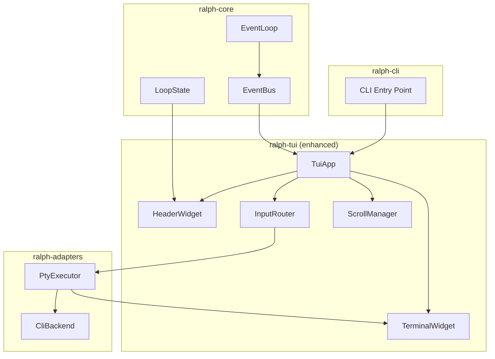
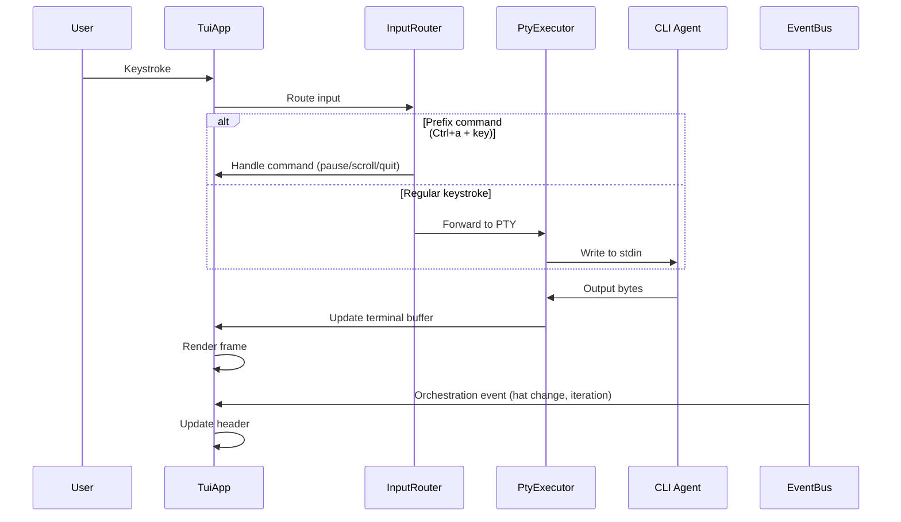
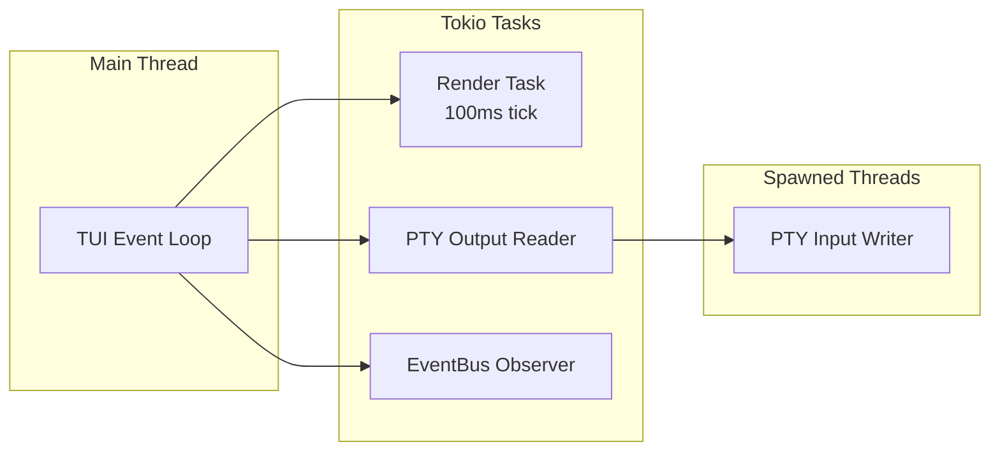

# Interactive TUI Mode - Detailed Design

---
status: draft
gap_analysis: null
related:
  - ../../../specs/event-loop.spec.md
  - ../../../specs/cli-adapters.spec.md
---

## Overview

This spec defines a unified Terminal User Interface (TUI) for Ralph's interactive mode. When users run `ralph run -i`, Ralph launches a full-screen TUI with:

1. **Header bar**: Displays orchestration context (iteration, elapsed time, hat, idle timeout, mode)
2. **Terminal pane**: Fully interactive embedded PTY hosting the CLI agent (Claude, Codex, Kiro, etc.)

The TUI provides tmux-style prefix commands (`Ctrl+a` + key) for loop control while forwarding all other input to the agent. This replaces both the current raw PTY interactive mode and the separate `--tui` monitoring mode.

### Design Principles

- **KISS**: Minimal chrome—the agent terminal is the star
- **Terminal multiplexer UX**: Familiar patterns from tmux/zellij
- **Performance**: Zellij-tier smooth scrolling
- **Let Ralph Ralph**: Auto-advance on errors/timeouts; user intervenes only when desired

---

## Detailed Requirements

### Layout

| Element | Description |
|---------|-------------|
| **Header** | Single-line status bar with iteration, time, hat, idle countdown, mode |
| **Separator** | Horizontal line between header and terminal |
| **Terminal pane** | Full remaining screen height; embedded interactive PTY |

Header format:
```
[iter 3/10] 04:32 | 🎯 Executing | idle: 25s | ▶ auto
────────────────────────────────────────────────────────
```

### Interactivity

- Fully interactive terminal session (not read-only)
- All keystrokes forwarded to PTY except prefix commands
- Scrollback with smooth, performant navigation
- User can type, respond to prompts, scroll history

### Prefix Commands

Default prefix: `Ctrl+a` (rebindable in config)

| Command | Action |
|---------|--------|
| `Ctrl+a p` | Pause/resume the orchestration loop |
| `Ctrl+a n` | Skip to next iteration (force advance) |
| `Ctrl+a a` | Abort loop entirely |
| `Ctrl+a [` | Enter scroll mode |
| `Ctrl+a q` | Quit TUI and Ralph |
| `Ctrl+a ?` | Show help overlay |

### Scroll Mode (tmux-style)

**Enter**: `Ctrl+a [`

**Navigation**:
- `j`/`k` or `↑`/`↓`: Line up/down
- `Ctrl+u`/`Ctrl+d`: Half-page up/down
- `Page Up`/`Page Down`: Full page
- `g`/`G`: Top/bottom of history
- `Home`/`End`: Beginning/end of history

**Search**:
- `/`: Forward search
- `?`: Backward search
- `n`/`N`: Next/previous match

**Exit**: `q`, `Escape`, or `Enter`

### Iteration Boundaries

- Terminal clears at iteration boundary (fresh start)
- Scrollback from previous iteration discarded (not preserved in TUI)
- Header updates to show new iteration number
- Clear transition is the visual indicator (no pause needed)

### Error Handling

| Scenario | Behavior |
|----------|----------|
| Agent crashes | Auto-advance to next iteration (idle timeout triggers) |
| Idle timeout expires | Auto-advance to next iteration |
| Ctrl+C in terminal | Forward to agent as interrupt |
| Double Ctrl+C (within 1s) | Terminate agent, advance iteration |
| Ctrl+\ | Force kill agent immediately |

### Configuration

In `ralph.yml`:
```yaml
tui:
  prefix_key: "ctrl-a"  # Rebindable
  # Future: colors, scroll_buffer_size, etc.
```

### CLI Flags

| Flag | Behavior |
|------|----------|
| `-i` / `--interactive` | Launch unified TUI (new behavior) |
| `-a` / `--autonomous` | Headless mode (no TUI) |
| `--tui` | **Deprecated** - now implied by `-i` |

---

## Architecture Overview

### Component Diagram



### Data Flow



### Thread/Task Model



---

## Components and Interfaces

### 1. TuiApp (Enhanced)

The main TUI application, evolved from current `ralph-tui`.

```rust
pub struct TuiApp {
    state: Arc<Mutex<TuiState>>,
    terminal_widget: TerminalWidget,
    input_router: InputRouter,
    scroll_manager: ScrollManager,
    config: TuiConfig,
}

impl TuiApp {
    /// Create TUI with PTY connection
    pub fn new(pty_handle: PtyHandle, config: TuiConfig) -> Self;

    /// Run the TUI event loop
    pub async fn run(&mut self) -> Result<()>;

    /// Get observer for EventBus integration
    pub fn observer(&self) -> impl Fn(&Event) + Send + Sync;
}
```

### 2. TerminalWidget

New widget for rendering embedded PTY output.

```rust
pub struct TerminalWidget {
    parser: vt100::Parser,
    screen: vt100::Screen,
    scroll_offset: usize,
}

impl TerminalWidget {
    /// Feed PTY output bytes
    pub fn process(&mut self, bytes: &[u8]);

    /// Clear screen (for iteration boundary)
    pub fn clear(&mut self);

    /// Get current screen dimensions
    pub fn size(&self) -> (u16, u16);
}

impl StatefulWidget for TerminalWidget {
    type State = ScrollState;
    fn render(self, area: Rect, buf: &mut Buffer, state: &mut Self::State);
}
```

### 3. InputRouter

Routes keystrokes between TUI commands and PTY.

```rust
pub struct InputRouter {
    prefix_key: KeyCode,
    prefix_pressed: bool,
    mode: InputMode,
}

pub enum InputMode {
    Normal,      // Forward to PTY
    Prefix,      // Waiting for command after prefix
    Scroll,      // In scroll mode
    Help,        // Showing help overlay
}

pub enum InputAction {
    ForwardToPty(Vec<u8>),
    PauseResume,
    SkipIteration,
    AbortLoop,
    EnterScroll,
    ExitScroll,
    Quit,
    ShowHelp,
    HideHelp,
    ScrollUp(usize),
    ScrollDown(usize),
    SearchForward(String),
    SearchBackward(String),
    NextMatch,
    PrevMatch,
}

impl InputRouter {
    pub fn handle(&mut self, event: KeyEvent) -> InputAction;
}
```

### 4. ScrollManager

Manages scrollback buffer and scroll position.

```rust
pub struct ScrollManager {
    buffer: VecDeque<Line>,
    viewport_offset: usize,
    search_matches: Vec<Position>,
    current_match: Option<usize>,
}

impl ScrollManager {
    pub fn scroll_up(&mut self, lines: usize);
    pub fn scroll_down(&mut self, lines: usize);
    pub fn scroll_to_top(&mut self);
    pub fn scroll_to_bottom(&mut self);
    pub fn search(&mut self, pattern: &str, forward: bool);
    pub fn next_match(&mut self);
    pub fn prev_match(&mut self);
}
```

### 5. PtyHandle

Interface between TUI and PtyExecutor (new abstraction).

```rust
pub struct PtyHandle {
    output_rx: mpsc::UnboundedReceiver<Vec<u8>>,
    input_tx: mpsc::UnboundedSender<Vec<u8>>,
    control_tx: mpsc::UnboundedSender<PtyControl>,
}

pub enum PtyControl {
    Resize { rows: u16, cols: u16 },
    Terminate,
}

impl PtyHandle {
    /// Write bytes to PTY stdin
    pub fn write(&self, bytes: &[u8]) -> Result<()>;

    /// Receive output bytes from PTY
    pub async fn recv(&mut self) -> Option<Vec<u8>>;

    /// Send control signal
    pub fn control(&self, ctrl: PtyControl) -> Result<()>;
}
```

### 6. TuiState (Enhanced)

Extended from current implementation.

```rust
pub struct TuiState {
    // Existing fields
    pub pending_hat: Option<(HatId, String)>,
    pub iteration: u32,
    pub max_iterations: Option<u32>,
    pub loop_started: Option<Instant>,
    pub iteration_started: Option<Instant>,

    // New fields
    pub mode: LoopMode,
    pub idle_timeout_remaining: Option<Duration>,
    pub scroll_mode: bool,
}

pub enum LoopMode {
    Auto,    // ▶ auto
    Paused,  // ⏸ paused
}
```

---

## Data Models

### Configuration

```rust
pub struct TuiConfig {
    pub prefix_key: KeyCode,
    pub scroll_buffer_size: usize,  // Default: 10000 lines
    pub render_interval_ms: u64,    // Default: 16 (60fps)
}

impl Default for TuiConfig {
    fn default() -> Self {
        Self {
            prefix_key: KeyCode::Char('a'),  // Ctrl+a
            scroll_buffer_size: 10000,
            render_interval_ms: 16,
        }
    }
}
```

### Header Format

```rust
pub struct HeaderData {
    pub iteration: u32,
    pub max_iterations: Option<u32>,
    pub elapsed: Duration,
    pub hat: Option<String>,
    pub idle_remaining: Option<Duration>,
    pub mode: LoopMode,
}

impl HeaderData {
    pub fn format(&self) -> String {
        // [iter 3/10] 04:32 | 🎯 Executing | idle: 25s | ▶ auto
        format!(
            "[iter {}{}] {} | {} | idle: {}s | {}",
            self.iteration,
            self.max_iterations.map(|m| format!("/{}", m)).unwrap_or_default(),
            format_duration(self.elapsed),
            self.hat.as_deref().unwrap_or("—"),
            self.idle_remaining.map(|d| d.as_secs()).unwrap_or(0),
            match self.mode {
                LoopMode::Auto => "▶ auto",
                LoopMode::Paused => "⏸ paused",
            }
        )
    }
}
```

---

## Error Handling

### Terminal State Recovery

```rust
impl TuiApp {
    pub async fn run(&mut self) -> Result<()> {
        // Use scopeguard to ensure terminal cleanup
        let _guard = scopeguard::guard((), |_| {
            let _ = disable_raw_mode();
            let _ = execute!(io::stdout(), LeaveAlternateScreen);
        });

        enable_raw_mode()?;
        execute!(io::stdout(), EnterAlternateScreen)?;

        self.event_loop().await
    }
}
```

### PTY Crash Recovery

```rust
impl TuiApp {
    async fn handle_pty_disconnect(&mut self) {
        // PTY process exited (crash or normal)
        // Update header to show transition
        self.state.lock().unwrap().pending_hat = Some("transitioning".into());

        // Clear terminal for next iteration
        self.terminal_widget.clear();

        // EventLoop handles iteration advancement via idle timeout
    }
}
```

### Graceful Shutdown

```rust
pub enum ShutdownReason {
    UserQuit,       // Ctrl+a q
    LoopComplete,   // All iterations done
    LoopAbort,      // Ctrl+a a
    Error(String),  // Unrecoverable error
}

impl TuiApp {
    async fn shutdown(&mut self, reason: ShutdownReason) -> Result<()> {
        // 1. Signal PTY to terminate
        self.pty_handle.control(PtyControl::Terminate)?;

        // 2. Wait briefly for clean exit
        tokio::time::sleep(Duration::from_millis(100)).await;

        // 3. Restore terminal (handled by scopeguard)
        Ok(())
    }
}
```

---

## Testing Strategy

### Unit Tests

| Component | Test Focus |
|-----------|------------|
| `InputRouter` | Prefix detection, mode transitions, command mapping |
| `ScrollManager` | Scroll position, bounds checking, search matching |
| `HeaderData` | Format string generation, edge cases (no max, paused) |
| `TerminalWidget` | vt100 parsing, screen state, ANSI handling |

### Integration Tests

| Test | Description |
|------|-------------|
| PTY embedding | Spawn simple command, verify output renders |
| Input forwarding | Type characters, verify PTY receives them |
| Prefix commands | Test each prefix command behavior |
| Scroll mode | Enter/exit scroll, verify navigation |
| Iteration boundary | Verify screen clears, header updates |

### Manual Testing Checklist

- [ ] Launch with `-i` flag, verify TUI appears
- [ ] Type in terminal, verify agent receives input
- [ ] Press `Ctrl+a p` to pause, verify header shows "⏸ paused"
- [ ] Press `Ctrl+a [` to enter scroll mode, navigate with j/k
- [ ] Search with `/`, verify matches highlighted
- [ ] Complete iteration, verify screen clears
- [ ] Press `Ctrl+a q` to quit, verify clean exit
- [ ] Resize terminal window, verify layout adjusts
- [ ] Test with Claude, Kiro, Codex backends

---

## Appendices

### A. Technology Choices

| Choice | Rationale |
|--------|-----------|
| **tui-term** for PTY widget | Purpose-built for ratatui, uses vt100 internally, lowest integration cost |
| **vt100** for parsing | Already in Ralph, mature, handles ANSI sequences |
| **portable-pty** for PTY | Already in Ralph, cross-platform, from WezTerm |
| **Prefix key over modal** | Simpler than zellij's modal system, familiar to tmux users |
| **100ms → 16ms render** | 60fps for smooth scrolling (zellij-tier performance) |

### B. Research Summary

- **Zellij**: Three-section scrollback buffer (lines_above/viewport/lines_below), lazy rewrapping
- **Ratatui + PTY**: Layered stack pattern (tui-term → vt100 → portable-pty)
- **Current Ralph TUI**: Observer-based, reusable state management
- **Current PTY Executor**: Needs trait extraction for output/input handlers

### C. Migration Path

1. **Phase 1**: Add `TerminalWidget` using tui-term
2. **Phase 2**: Implement `InputRouter` with prefix commands
3. **Phase 3**: Integrate with `PtyExecutor` via `PtyHandle`
4. **Phase 4**: Add scroll mode and search
5. **Phase 5**: Deprecate old `--tui` flag, update docs

### D. Alternative Approaches Considered

| Approach | Why Not Chosen |
|----------|----------------|
| Zellij/tmux integration | External dependency, less control over UX |
| alacritty_terminal | Overkill for embedded use, complex API |
| Modal input system | More complex state machine, steeper learning curve |
| Separate `--tui-interactive` flag | Flag proliferation, confusing mental model |

### E. Deprecation: interactive-mode.spec.md

The existing `specs/interactive-mode.spec.md` is deprecated by this spec. Key elements carried forward:

- Agent flag filtering per backend (unchanged)
- Signal handling semantics (Ctrl+C double-press, Ctrl+\)
- Idle timeout mechanics (reset on output AND input)
- Terminal fallback when stdout is not a TTY

---

## Acceptance Criteria

### TUI Launch

- **Given** user runs `ralph run -i`
- **When** stdout is a TTY
- **Then** full-screen TUI launches with header and terminal pane

- **Given** user runs `ralph run -i`
- **When** stdout is NOT a TTY (piped)
- **Then** warning logged, falls back to autonomous mode

### Header Display

- **Given** TUI is running
- **When** iteration advances
- **Then** header shows updated iteration number

- **Given** TUI is running with idle timeout configured
- **When** time passes without activity
- **Then** header shows countdown (idle: Ns)

- **Given** user presses `Ctrl+a p`
- **When** loop was running
- **Then** header shows "⏸ paused" and loop pauses

### Terminal Interaction

- **Given** TUI is running in normal mode
- **When** user types a character
- **Then** character is forwarded to PTY (appears in agent output)

- **Given** TUI is running
- **When** agent produces ANSI output (colors, spinners)
- **Then** output renders correctly with formatting

### Prefix Commands

- **Given** TUI is running
- **When** user presses `Ctrl+a p`
- **Then** loop toggles between auto and paused

- **Given** TUI is running
- **When** user presses `Ctrl+a n`
- **Then** current iteration terminates, next iteration begins

- **Given** TUI is running
- **When** user presses `Ctrl+a a`
- **Then** loop aborts, TUI exits cleanly

- **Given** TUI is running
- **When** user presses `Ctrl+a q`
- **Then** TUI exits, terminal restored

- **Given** TUI is running
- **When** user presses `Ctrl+a ?`
- **Then** help overlay appears with keybinding list

### Scroll Mode

- **Given** TUI is running
- **When** user presses `Ctrl+a [`
- **Then** scroll mode activates, input no longer forwarded to PTY

- **Given** scroll mode is active
- **When** user presses `j` or `↓`
- **Then** viewport scrolls down one line

- **Given** scroll mode is active
- **When** user presses `q` or `Escape`
- **Then** scroll mode exits, returns to normal mode

- **Given** scroll mode is active
- **When** user types `/pattern`
- **Then** search executes, matches highlighted

### Iteration Boundaries

- **Given** iteration completes
- **When** next iteration begins
- **Then** terminal pane clears (fresh start)

- **Given** agent crashes mid-iteration
- **When** idle timeout expires
- **Then** auto-advance to next iteration

### Signal Handling

- **Given** TUI is running
- **When** user presses `Ctrl+C` once
- **Then** Ctrl+C forwarded to agent

- **Given** TUI is running
- **When** user presses `Ctrl+C` twice within 1 second
- **Then** agent terminated, iteration advances

- **Given** TUI is running
- **When** user presses `Ctrl+\`
- **Then** agent force-killed immediately

### Terminal State

- **Given** TUI exits (any reason)
- **When** exit completes
- **Then** terminal restored to original state (raw mode disabled, alternate screen exited)

---

## Non-Goals

- **Multiple panes**: Single terminal pane only (no splits)
- **Session persistence**: No detach/reattach (not a full multiplexer)
- **Mouse support**: Keyboard-only for initial version
- **Custom theming**: Sensible defaults only (can add later)
- **Per-iteration log files in TUI**: Logs go to disk, not displayed in TUI
