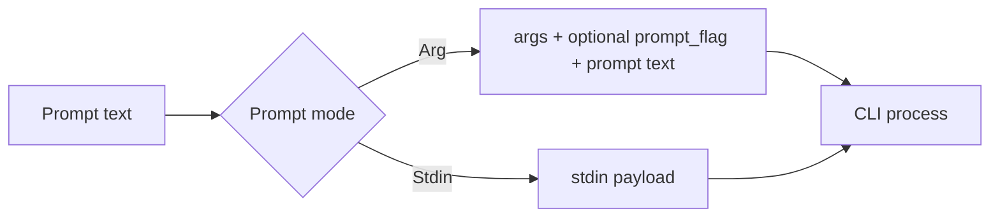

# CLI interaction patterns (headless vs interactive)

## Repo-defined patterns
Sources: `crates/ralph-adapters/src/cli_backend.rs`, `specs/e2e-testing/research/ralph-backends.md`

| Backend | Headless command in repo | Prompt mode | Output format | Interactive prompt variant (repo) |
|---|---|---|---|---|
| Claude | `claude --dangerously-skip-permissions --verbose --output-format stream-json -p "..."` | Arg (`-p`) | NDJSON (stream-json) | Positional arg (no `-p`) via `claude_interactive()` |
| Kiro | `kiro-cli chat --no-interactive --trust-all-tools "..."` | Arg (positional) | Text | Removes `--no-interactive` |
| Gemini | `gemini --yolo -p "..."` | Arg (`-p`) | Text | Uses `-i` flag for interactive prompt |
| Codex | `codex exec --full-auto "..."` | Arg (positional) | Text | Removes `exec` and `--full-auto` |
| Amp | `amp --dangerously-allow-all -x "..."` | Arg (`-x`) | Text | Removes `--dangerously-allow-all` |
| Copilot | `copilot --allow-all-tools -p "..."` | Arg (`-p`) | Text | Removes `--allow-all-tools` |
| OpenCode | `opencode run "..."` | Arg (positional) | Text | `opencode --prompt "..."` (per repo) |
| Custom | `command args...` | Arg or stdin | Text | Uses `prompt_mode`/`prompt_flag` from config |

### Notes from repo behavior
- Claude large prompts (>7000 chars) are written to a temp file; the prompt becomes an instruction to read that file.
- `prompt_mode: stdin` is supported for custom backends; `build_command` writes the prompt to stdin and closes it.
- Interactive conversions use `CliBackend::for_interactive_prompt()` and `filter_args_for_interactive()`.

### Potential mismatches to flag
- An older task spec suggested OpenCode `-p` and `--dangerously-skip-permissions`, but current repo uses `opencode run` for headless and `--prompt` for interactive. This likely reflects a change in OpenCode CLI conventions.

## External references (CLI semantics)
- Claude CLI reference and headless prompt flag: https://docs.anthropic.com/en/docs/claude-code/cli-reference
- Claude headless mode and output-format options (text/json/stream-json): https://docs.anthropic.com/en/docs/claude-code/headless
- OpenCode CLI usage (`opencode run [message..]`): https://opencode.ai/docs/cli/

## Prompt delivery data flow (conceptual)

