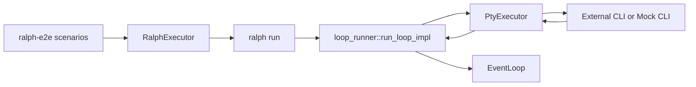

# E2E harness flow and adapter insertion points

## Key files reviewed
- crates/ralph-e2e/src/executor.rs
- crates/ralph-e2e/src/runner.rs
- crates/ralph-e2e/src/workspace.rs
- crates/ralph-e2e/src/backend.rs
- crates/ralph-cli/src/loop_runner.rs

## How E2E runs today
- Each scenario creates an isolated workspace with a `ralph.yml` tailored to the backend under test.
- `RalphExecutor` spawns `ralph run -c ralph.yml --max-iterations N` in that workspace and captures stdout/stderr, exit code, and artifacts.
- Backend availability checks call `<backend> --version` to decide whether to run or skip a scenario.
- The ralph CLI then executes the event loop, which invokes the configured CLI backend through PTY streaming.

## Existing test doubles (not wired into E2E)
- `ralph-core` has `MockBackend` and `ReplayBackend` for unit/smoke tests.
- These are used by replay-based smoke tests (`crates/ralph-core/src/testing/*`), not by `ralph-e2e`.

## Adapter insertion points for mocking
- E2E scenarios can set `cli.backend: custom` and provide `command`, `args`, `prompt_mode`, and `prompt_flag` in `ralph.yml`.
- Alternatively, a first-class built-in backend (e.g., `mock`) could be added to `CliBackend::from_config()` plus `auto_detect.rs`.
- Because `ralph run` always uses PTY streaming, any mock CLI must support PTY execution and should emit output compatible with `EventParser` (plain text with `<event>` tags) or Claude-style NDJSON if emulating Claude.

## Harness data flow

