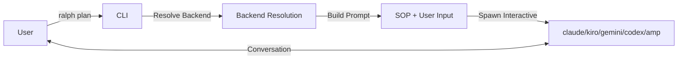
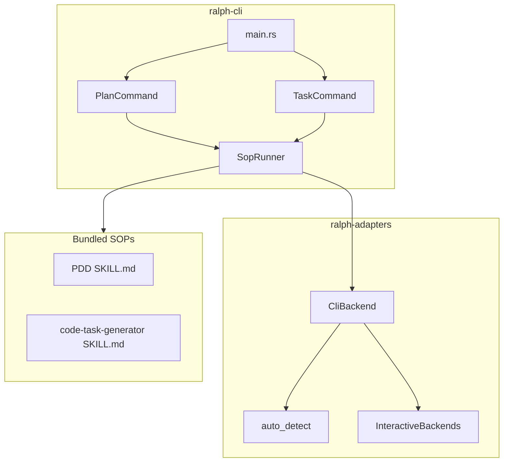
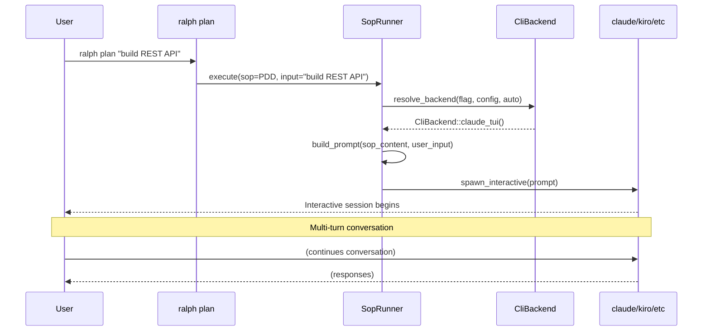
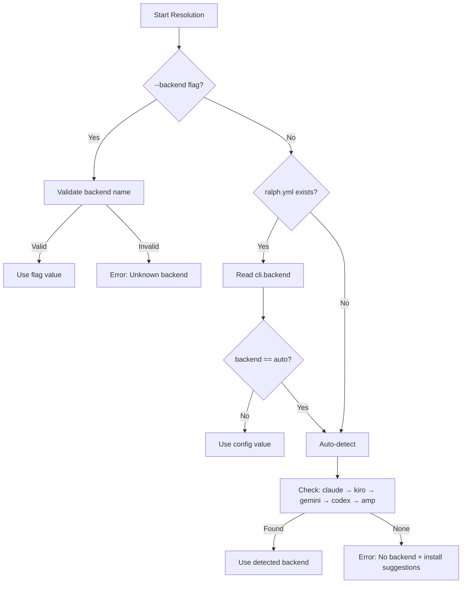

# Detailed Design: SOP Injection Subcommands

## Overview

This document describes the design for two new top-level CLI commands in ralph-orchestrator:

- **`ralph plan`** - Launches an interactive PDD (Prompt-Driven Development) session
- **`ralph task`** - Launches an interactive code-task-generator session

These commands are thin wrappers that bypass Ralph's event loop entirely, directly spawning the user's preferred AI backend with bundled SOP content as the initial prompt.



## Detailed Requirements

### Functional Requirements

| ID | Requirement | Source |
|----|-------------|--------|
| FR1 | Commands bypass Ralph's event loop - no hats, no event bus, no iteration | Q1 |
| FR2 | Backend resolution: CLI flag → config file → auto-detect | Q2 |
| FR3 | SOP content passed via backend's prompt mechanism (inline) | Q3 |
| FR4 | Always run in interactive mode for conversational workflows | Q4 |
| FR5 | SOP files bundled with binary via `include_str!` | Q5 |
| FR6 | Optional positional args; SOP prompts if not provided | Q6 |
| FR7 | Top-level commands: `ralph plan`, `ralph task` | Q7 |
| FR8 | Prompt format: `<sop>...</sop><user-content>...</user-content>` | Q8 |
| FR9 | Error handling: fail fast with installation suggestions | Q9 |

### Non-Functional Requirements

| ID | Requirement |
|----|-------------|
| NFR1 | Commands should start quickly (< 500ms to backend spawn) |
| NFR2 | No network calls except backend's own API calls |
| NFR3 | Work offline if backend supports offline mode |
| NFR4 | Consistent behavior across all supported backends |

## Architecture Overview

### Component Diagram



### Data Flow



## Components and Interfaces

### 1. CLI Command Definitions

```rust
// In main.rs - add to Commands enum
#[derive(Subcommand, Debug)]
enum Commands {
    // ... existing commands ...

    /// Start a Prompt-Driven Development planning session
    Plan(PlanArgs),

    /// Generate code task files from descriptions or plans
    Task(TaskArgs),
}

#[derive(Parser, Debug)]
struct PlanArgs {
    /// The rough idea to develop (optional - SOP will prompt if not provided)
    #[arg(value_name = "IDEA")]
    idea: Option<String>,

    /// Backend to use (overrides config and auto-detection)
    #[arg(short, long, value_name = "BACKEND")]
    backend: Option<String>,
}

#[derive(Parser, Debug)]
struct TaskArgs {
    /// Input: description text or path to PDD plan file
    #[arg(value_name = "INPUT")]
    input: Option<String>,

    /// Backend to use (overrides config and auto-detection)
    #[arg(short, long, value_name = "BACKEND")]
    backend: Option<String>,
}
```

### 2. SopRunner Module

New module in `ralph-cli/src/sop_runner.rs`:

```rust
//! SOP Runner - executes bundled SOPs in interactive backend sessions.

use ralph_adapters::{CliBackend, auto_detect};
use ralph_core::RalphConfig;
use std::process::{Command, Stdio};

/// Bundled SOP content
pub mod sops {
    pub const PDD: &str = include_str!("../../../.claude/skills/pdd/SKILL.md");
    pub const CODE_TASK_GENERATOR: &str =
        include_str!("../../../.claude/skills/code-task-generator/SKILL.md");
}

/// Which SOP to run
#[derive(Debug, Clone, Copy)]
pub enum Sop {
    Pdd,
    CodeTaskGenerator,
}

impl Sop {
    /// Returns the bundled SOP content
    pub fn content(&self) -> &'static str {
        match self {
            Sop::Pdd => sops::PDD,
            Sop::CodeTaskGenerator => sops::CODE_TASK_GENERATOR,
        }
    }

    /// Returns a human-readable name
    pub fn name(&self) -> &'static str {
        match self {
            Sop::Pdd => "Prompt-Driven Development",
            Sop::CodeTaskGenerator => "Code Task Generator",
        }
    }
}

/// Configuration for running an SOP
pub struct SopRunConfig {
    /// Which SOP to execute
    pub sop: Sop,
    /// Optional user-provided input
    pub user_input: Option<String>,
    /// Explicit backend override
    pub backend_override: Option<String>,
    /// Path to config file (for backend resolution)
    pub config_path: Option<PathBuf>,
}

/// Errors that can occur when running an SOP
#[derive(Debug, thiserror::Error)]
pub enum SopRunError {
    #[error("No supported backend found.\n\n{0}")]
    NoBackend(#[from] auto_detect::NoBackendError),

    #[error("Unknown backend: {0}")]
    UnknownBackend(String),

    #[error("Failed to spawn backend: {0}")]
    SpawnError(#[from] std::io::Error),

    #[error("Config error: {0}")]
    ConfigError(String),
}

/// Runs an SOP in an interactive backend session
pub fn run_sop(config: SopRunConfig) -> Result<(), SopRunError> {
    // 1. Resolve backend
    let backend = resolve_backend(
        config.backend_override.as_deref(),
        config.config_path.as_ref(),
    )?;

    // 2. Build the prompt
    let prompt = build_prompt(config.sop, config.user_input.as_deref());

    // 3. Get interactive backend configuration
    let cli_backend = backend.for_interactive_prompt()?;

    // 4. Spawn the interactive session
    spawn_interactive(&cli_backend, &prompt)?;

    Ok(())
}

/// Resolves which backend to use
fn resolve_backend(
    flag_override: Option<&str>,
    config_path: Option<&PathBuf>,
) -> Result<String, SopRunError> {
    // 1. CLI flag takes precedence
    if let Some(backend) = flag_override {
        validate_backend_name(backend)?;
        return Ok(backend.to_string());
    }

    // 2. Check config file
    if let Some(path) = config_path {
        if path.exists() {
            if let Ok(config) = RalphConfig::from_file(path) {
                if config.cli.backend != "auto" {
                    return Ok(config.cli.backend);
                }
            }
        }
    }

    // 3. Auto-detect
    auto_detect::detect_backend_default()
        .map_err(SopRunError::NoBackend)
}

/// Validates a backend name
fn validate_backend_name(name: &str) -> Result<(), SopRunError> {
    match name {
        "claude" | "kiro" | "gemini" | "codex" | "amp" => Ok(()),
        _ => Err(SopRunError::UnknownBackend(name.to_string())),
    }
}

/// Builds the combined SOP + user input prompt
fn build_prompt(sop: Sop, user_input: Option<&str>) -> String {
    let sop_content = sop.content();

    match user_input {
        Some(input) => format!(
            "<sop>\n{}\n</sop>\n<user-content>\n{}\n</user-content>",
            sop_content, input
        ),
        None => format!("<sop>\n{}\n</sop>", sop_content),
    }
}

/// Spawns an interactive backend session
fn spawn_interactive(backend: &CliBackend, prompt: &str) -> Result<(), SopRunError> {
    let (command, args, stdin_input, _temp_file) = backend.build_command(prompt, true);

    let mut child = Command::new(&command)
        .args(&args)
        .stdin(Stdio::inherit())
        .stdout(Stdio::inherit())
        .stderr(Stdio::inherit())
        .spawn()?;

    // If using stdin mode, write the prompt
    if let Some(input) = stdin_input {
        use std::io::Write;
        if let Some(mut stdin) = child.stdin.take() {
            stdin.write_all(input.as_bytes())?;
        }
    }

    // Wait for the interactive session to complete
    child.wait()?;

    Ok(())
}
```

### 3. Interactive Backend Extensions

Add to `ralph-adapters/src/cli_backend.rs`:

```rust
impl CliBackend {
    /// Creates a backend configured for interactive mode with initial prompt.
    ///
    /// This differs from headless mode in how the prompt is passed:
    /// - Claude: positional arg (no -p flag)
    /// - Kiro: removes --no-interactive
    /// - Gemini: uses -i instead of -p
    /// - Codex: no exec subcommand
    /// - Amp: removes --dangerously-allow-all
    pub fn for_interactive_prompt(backend_name: &str) -> Result<Self, CustomBackendError> {
        match backend_name {
            "claude" => Ok(Self::claude_tui()),
            "kiro" => Ok(Self::kiro_interactive()),
            "gemini" => Ok(Self::gemini_interactive()),
            "codex" => Ok(Self::codex_interactive()),
            "amp" => Ok(Self::amp_interactive()),
            _ => Err(CustomBackendError),
        }
    }

    /// Kiro in interactive mode (removes --no-interactive)
    pub fn kiro_interactive() -> Self {
        Self {
            command: "kiro-cli".to_string(),
            args: vec![
                "chat".to_string(),
                "--trust-all-tools".to_string(),
            ],
            prompt_mode: PromptMode::Arg,
            prompt_flag: None,
            output_format: OutputFormat::Text,
        }
    }

    /// Gemini in interactive mode with initial prompt (uses -i, not -p)
    pub fn gemini_interactive() -> Self {
        Self {
            command: "gemini".to_string(),
            args: vec!["--yolo".to_string()],
            prompt_mode: PromptMode::Arg,
            prompt_flag: Some("-i".to_string()),  // Interactive prompt flag
            output_format: OutputFormat::Text,
        }
    }

    /// Codex in interactive TUI mode (no exec subcommand)
    pub fn codex_interactive() -> Self {
        Self {
            command: "codex".to_string(),
            args: vec![],  // No exec, no --full-auto
            prompt_mode: PromptMode::Arg,
            prompt_flag: None,  // Positional argument
            output_format: OutputFormat::Text,
        }
    }

    /// Amp in interactive mode (removes --dangerously-allow-all)
    pub fn amp_interactive() -> Self {
        Self {
            command: "amp".to_string(),
            args: vec![],
            prompt_mode: PromptMode::Arg,
            prompt_flag: Some("-x".to_string()),
            output_format: OutputFormat::Text,
        }
    }
}
```

### 4. Error Display Enhancement

Enhance `NoBackendError` in `auto_detect.rs`:

```rust
impl std::fmt::Display for NoBackendError {
    fn fmt(&self, f: &mut std::fmt::Formatter<'_>) -> std::fmt::Result {
        writeln!(f, "No supported AI backend found in PATH.")?;
        writeln!(f)?;
        writeln!(f, "Checked backends: {}", self.checked.join(", "))?;
        writeln!(f)?;
        writeln!(f, "Install one of the following:")?;
        writeln!(f)?;
        writeln!(f, "  Claude CLI (recommended):")?;
        writeln!(f, "    npm install -g @anthropic-ai/claude-code")?;
        writeln!(f)?;
        writeln!(f, "  Kiro CLI:")?;
        writeln!(f, "    npm install -g @anthropic-ai/kiro-cli")?;
        writeln!(f)?;
        writeln!(f, "  Gemini CLI:")?;
        writeln!(f, "    npm install -g @anthropic-ai/gemini-cli")?;
        writeln!(f)?;
        writeln!(f, "  Or specify a backend explicitly:")?;
        writeln!(f, "    ralph plan --backend claude")?;
        Ok(())
    }
}
```

## Data Models

### Prompt Structure

```
┌─────────────────────────────────────────────┐
│ <sop>                                       │
│   [Full SOP markdown content]               │
│   - Overview                                │
│   - Parameters                              │
│   - Steps                                   │
│   - Examples                                │
│ </sop>                                      │
├─────────────────────────────────────────────┤
│ <user-content>           (optional)         │
│   [User's initial input if provided]        │
│ </user-content>                             │
└─────────────────────────────────────────────┘
```

### Backend Resolution Chain



## Error Handling

### Error Types and Messages

| Error | Cause | User Message |
|-------|-------|--------------|
| `NoBackend` | No CLI found in PATH | Lists checked backends + install instructions |
| `UnknownBackend` | Invalid `--backend` value | "Unknown backend: X. Valid options: claude, kiro, gemini, codex, amp" |
| `SpawnError` | Failed to start process | "Failed to spawn {backend}: {io_error}" |
| `ConfigError` | Invalid config file | "Config error: {details}" |

### Exit Codes

| Code | Meaning |
|------|---------|
| 0 | Success (backend session completed normally) |
| 1 | No backend available |
| 2 | Invalid arguments |
| 3 | Spawn failure |

## Testing Strategy

### Unit Tests

1. **Prompt Building**
   - Test `build_prompt()` with and without user input
   - Verify XML structure is correct
   - Test with empty strings and special characters

2. **Backend Resolution**
   - Test flag override takes precedence
   - Test config file reading
   - Test auto-detection fallback
   - Test invalid backend names

3. **Interactive Backend Configs**
   - Test each `*_interactive()` method produces correct args
   - Verify no headless flags are present
   - Test prompt flag differences (Gemini `-i` vs `-p`)

### Integration Tests

1. **Mock Backend Tests**
   - Create a mock "backend" script that echoes args
   - Verify correct command construction
   - Test stdin vs arg prompt passing

2. **Config File Tests**
   - Test with various `ralph.yml` configurations
   - Test missing config file behavior
   - Test malformed config handling

### Manual Testing Checklist

- [ ] `ralph plan` with Claude backend
- [ ] `ralph plan "test idea"` with initial input
- [ ] `ralph plan --backend kiro`
- [ ] `ralph task` with Gemini backend
- [ ] `ralph task path/to/plan.md` with file input
- [ ] Error case: no backend installed
- [ ] Error case: invalid `--backend` value

## Appendices

### A. Technology Choices

| Choice | Rationale |
|--------|-----------|
| `include_str!` for SOPs | Self-contained binary, consistent with preset bundling |
| XML tags for prompt structure | Clear delineation, easy for LLMs to parse |
| Direct process spawn | Simpler than PTY, backends handle their own TUI |
| `thiserror` for errors | Consistent with rest of codebase |

### B. Research Findings Summary

See `research/backend-compatibility.md` for full details.

**Key Insight**: Gemini requires `-i` flag (not `-p`) for interactive+prompt mode. Without this, sessions would exit after one response.

### C. Alternative Approaches Considered

1. **PTY-based interaction**
   - Pros: More control over terminal
   - Cons: Complexity, backends already have good TUIs
   - Decision: Rejected - let backends handle their own TUI

2. **Nested subcommands (`ralph sop plan`)**
   - Pros: Namespace organization for future SOPs
   - Cons: More typing, less discoverable
   - Decision: Rejected - top-level is simpler for now

3. **Config file for SOP content**
   - Pros: User-customizable SOPs
   - Cons: Complexity, version drift
   - Decision: Rejected - bundling ensures consistency

### D. Future Considerations

1. **Additional SOPs**: Could add more (spec-generator, etc.) following same pattern
2. **SOP overrides**: Allow `~/.ralph/sops/` for user customization
3. **Session resumption**: Integration with backend session management
