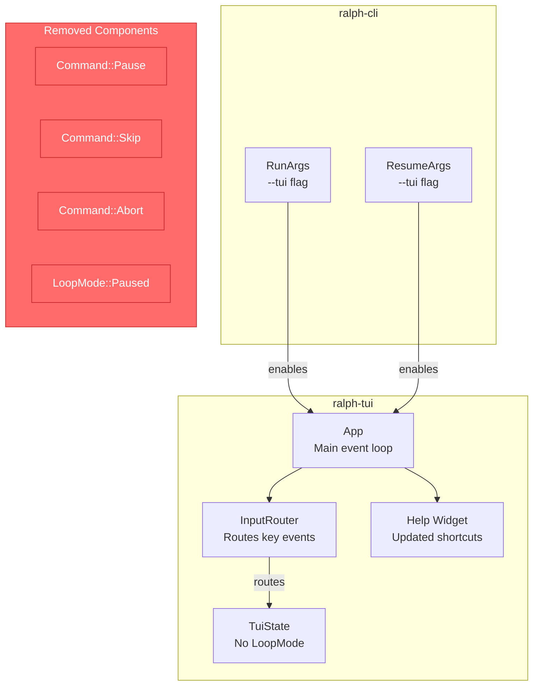
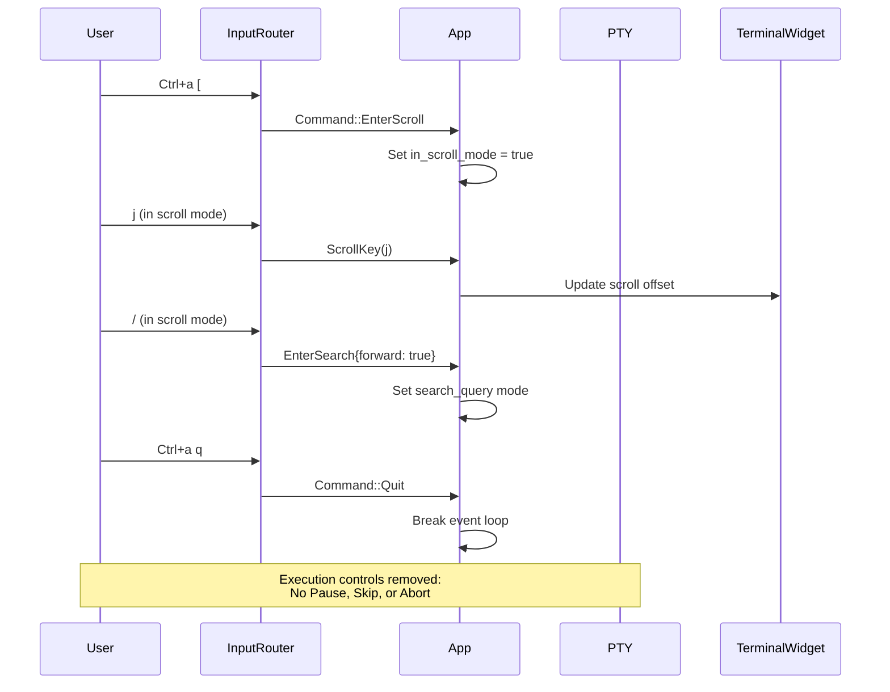

# TUI Observation Mode - Design Document

## 1. Overview

### Problem Statement
The current TUI is named "interactive mode" and provides execution controls (pause, skip, abort) that allow users to interfere with Ralph's autonomous operation. This creates semantic confusion and unnecessary complexity for a tool designed for observation.

### Solution Summary
Rename the TUI flag from `-i/--interactive` to `--tui` and remove execution controls while preserving observation aids (scroll, search). This transforms the TUI from an interactive control panel into a passive monitoring window.

## 2. Detailed Requirements

| ID | Requirement | Priority |
|----|-------------|----------|
| R1.1 | `--tui` becomes sole flag for TUI mode | Must |
| R1.2 | Remove `-i` and `--interactive` entirely | Must |
| R1.3 | Update all docs/examples/tests to use `--tui` | Must |
| R2.1 | Remove Pause command (`Ctrl+a p`) | Must |
| R2.2 | Remove Skip command (`Ctrl+a n`) | Must |
| R2.3 | Remove Abort command (`Ctrl+a a`) | Must |
| R2.4 | Remove `LoopMode::Paused` enum variant | Must |
| R3.1 | Keep Scroll mode (`Ctrl+a [`) | Must |
| R3.2 | Keep Search (`/`, `?`, `n/N`) | Must |
| R3.3 | Keep Help (`Ctrl+a ?`) | Must |
| R3.4 | Keep Quit (`Ctrl+a q`) | Must |
| R4.1 | Update help screen to remove execution controls | Must |
| R4.2 | Add scroll/search documentation to help | Should |

## 3. Architecture Overview



### Data Flow (After Changes)



## 4. Components and Interfaces

### 4.1 CLI Arguments (ralph-cli/src/main.rs)

**Before:**
```rust
#[arg(short, long, conflicts_with = "autonomous")]
interactive: bool,

#[arg(long, hide = true)]
tui: bool,  // deprecated
```

**After:**
```rust
#[arg(long, conflicts_with = "autonomous")]
tui: bool,
```

Changes:
- Remove `interactive` field entirely
- Make `tui` the primary field (remove `hide = true`)
- Remove short flag `-i`
- Applies to both `RunArgs` and `ResumeArgs`

### 4.2 Input Router (ralph-tui/src/input.rs)

**Command enum changes:**
```rust
// Before
pub enum Command {
    Quit,
    Help,
    Pause,    // REMOVE
    Skip,     // REMOVE
    Abort,    // REMOVE
    EnterScroll,
    Unknown,
}

// After
pub enum Command {
    Quit,
    Help,
    EnterScroll,
    Unknown,
}
```

**Key routing changes:**
```rust
// Before
RouteResult::Command(match c {
    'q' => Command::Quit,
    '?' => Command::Help,
    'p' => Command::Pause,    // REMOVE
    'n' => Command::Skip,     // REMOVE
    'a' => Command::Abort,    // REMOVE
    '[' => Command::EnterScroll,
    _ => Command::Unknown,
})

// After
RouteResult::Command(match c {
    'q' => Command::Quit,
    '?' => Command::Help,
    '[' => Command::EnterScroll,
    _ => Command::Unknown,
})
```

### 4.3 State Management (ralph-tui/src/state.rs)

**Remove LoopMode enum:**
```rust
// REMOVE entirely
pub enum LoopMode {
    Auto,
    Paused,
}
```

**Remove from TuiState:**
```rust
// REMOVE field
pub loop_mode: LoopMode,

// REMOVE from new() initialization
loop_mode: LoopMode::Auto,
```

### 4.4 App Event Loop (ralph-tui/src/app.rs)

**Remove command handlers:**
```rust
// REMOVE these match arms (lines 248-260)
Command::Pause => {
    let mut state = self.state.lock().unwrap();
    state.loop_mode = match state.loop_mode {
        crate::state::LoopMode::Auto => crate::state::LoopMode::Paused,
        crate::state::LoopMode::Paused => crate::state::LoopMode::Auto,
    };
}
Command::Skip => {
    let _ = self.control_tx.send(ralph_adapters::pty_handle::ControlCommand::Skip);
}
Command::Abort => {
    let _ = self.control_tx.send(ralph_adapters::pty_handle::ControlCommand::Abort);
}
```

**Remove pause check in PTY forwarding:**
```rust
// REMOVE these lines (232-240)
let is_paused = self.state.lock().unwrap().loop_mode == crate::state::LoopMode::Paused;
if !is_paused {
    // ...
}

// REPLACE with direct forwarding
if let Some(bytes) = key_event_to_bytes(key) {
    let _ = self.input_tx.send(bytes);
}
```

### 4.5 Help Widget (ralph-tui/src/widgets/help.rs)

**Update help text:**
```rust
let help_text = vec![
    Line::from(Span::styled(
        "Prefix Commands (Ctrl+a then key):",
        Style::default().fg(Color::Yellow),
    )),
    Line::from(""),
    Line::from(vec![
        Span::styled("  q", Style::default().fg(Color::Cyan)),
        Span::raw("  Quit TUI"),
    ]),
    Line::from(vec![
        Span::styled("  ?", Style::default().fg(Color::Cyan)),
        Span::raw("  Show this help"),
    ]),
    // REMOVE: p, n, a
    Line::from(vec![
        Span::styled("  [", Style::default().fg(Color::Cyan)),
        Span::raw("  Enter scroll mode"),
    ]),
    Line::from(""),
    Line::from(Span::styled(
        "Scroll Mode:",
        Style::default().fg(Color::Yellow),
    )),
    Line::from(vec![
        Span::styled("  j/k", Style::default().fg(Color::Cyan)),
        Span::raw("    Scroll up/down"),
    ]),
    Line::from(vec![
        Span::styled("  gg/G", Style::default().fg(Color::Cyan)),
        Span::raw("   Top/bottom"),
    ]),
    Line::from(vec![
        Span::styled("  /", Style::default().fg(Color::Cyan)),
        Span::raw("      Search forward"),
    ]),
    Line::from(vec![
        Span::styled("  ?", Style::default().fg(Color::Cyan)),
        Span::raw("      Search backward"),
    ]),
    Line::from(vec![
        Span::styled("  n/N", Style::default().fg(Color::Cyan)),
        Span::raw("    Next/prev match"),
    ]),
    Line::from(vec![
        Span::styled("  q/Esc", Style::default().fg(Color::Cyan)),
        Span::raw("  Exit scroll mode"),
    ]),
    Line::from(""),
    Line::from(Span::styled(
        "Press any key to dismiss",
        Style::default().fg(Color::DarkGray),
    )),
];
```

## 5. Data Models

No new data models. This change simplifies existing models:

**Removed:**
- `LoopMode` enum (2 variants → 0)
- `loop_mode` field from `TuiState`
- `Command::Pause`, `Command::Skip`, `Command::Abort` variants

## 6. Error Handling

### CLI Errors
- `-i` flag: "error: Found argument '-i' which wasn't expected..."
- `--interactive` flag: "error: Found argument '--interactive' which wasn't expected..."

### No New Error Modes
Removing features eliminates error paths; no new error handling needed.

## 7. Testing Strategy

### Unit Tests

**Input Router Tests (`input.rs`):**
- Remove `pause_command_returns_p` test
- Remove `skip_command_returns_n` test
- Remove `abort_command_returns_a` test
- Update existing tests that check command routing

**State Tests (`state.rs`):**
- Remove any tests referencing `LoopMode`

### Integration Tests

**CLI Argument Tests:**
- Test `--tui` flag enables TUI mode
- Test `-i` flag is rejected
- Test `--interactive` flag is rejected

### Manual E2E Testing

1. Run `ralph run --tui -c test-config.yml -p "test"` - verify TUI launches
2. Press `Ctrl+a p` - verify nothing happens (no pause)
3. Press `Ctrl+a n` - verify nothing happens (no skip)
4. Press `Ctrl+a a` - verify nothing happens (no abort)
5. Press `Ctrl+a [` - verify scroll mode works
6. Press `/` in scroll mode - verify search works
7. Press `Ctrl+a q` - verify clean exit

### Documentation Updates

Files to update (found via grep):
- `README.md`
- `CLAUDE.md`
- `docs/**/*.md` (multiple files)
- `specs/**/*.md` (multiple files)
- `presets/**/*.md`
- Behavior specs if applicable

## 8. Appendices

### A. Technology Choices

| Choice | Rationale |
|--------|-----------|
| Clean break (no aliases) | Project policy: no backward compatibility |
| Keep scroll/search | KISS: only remove what's necessary |
| Remove LoopMode enum | YAGNI: unused after pause removal |

### B. Alternative Approaches Considered

1. **Keep `-i` as deprecated alias**: Rejected per project policy
2. **Remove scroll/search too**: Rejected - these aid observation without affecting execution
3. **Add new `--observe` flag**: Rejected - unnecessary rename, `--tui` already exists

### C. Key Constraints

1. **No backward compatibility** - project policy
2. **KISS** - simplest solution that works
3. **YAGNI** - remove unused code paths
4. **Atomic update** - all docs/tests updated in single PR

### D. Files Changed

| File | Change Type |
|------|-------------|
| `crates/ralph-cli/src/main.rs` | Modify args |
| `crates/ralph-tui/src/input.rs` | Remove commands |
| `crates/ralph-tui/src/state.rs` | Remove LoopMode |
| `crates/ralph-tui/src/app.rs` | Remove handlers |
| `crates/ralph-tui/src/widgets/help.rs` | Update help text |
| `~30 documentation files` | Update `-i` to `--tui` |
