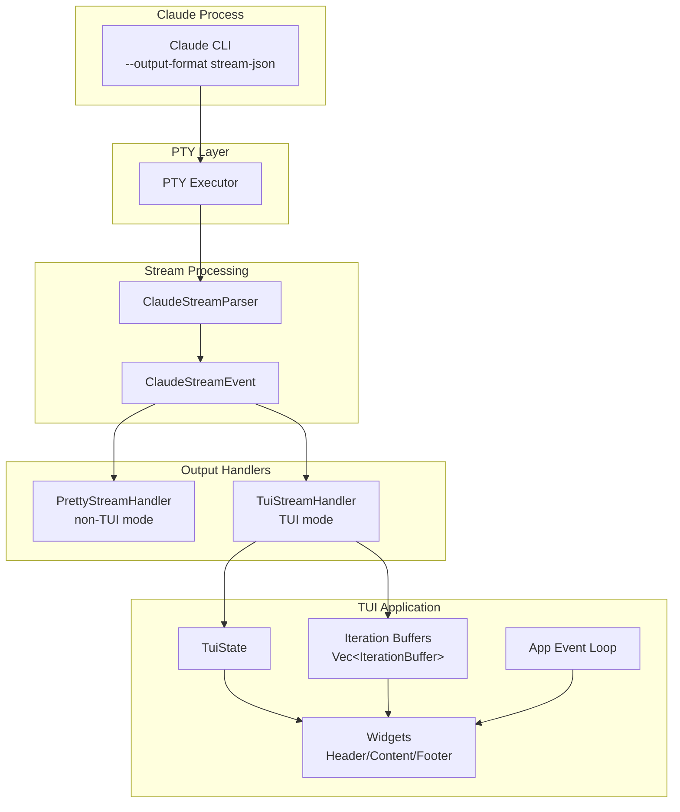
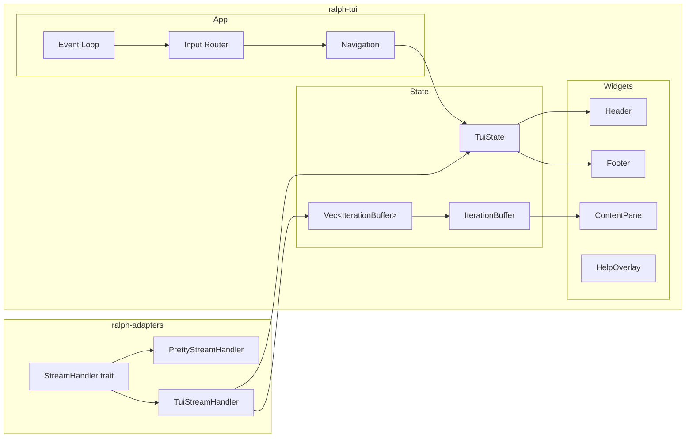
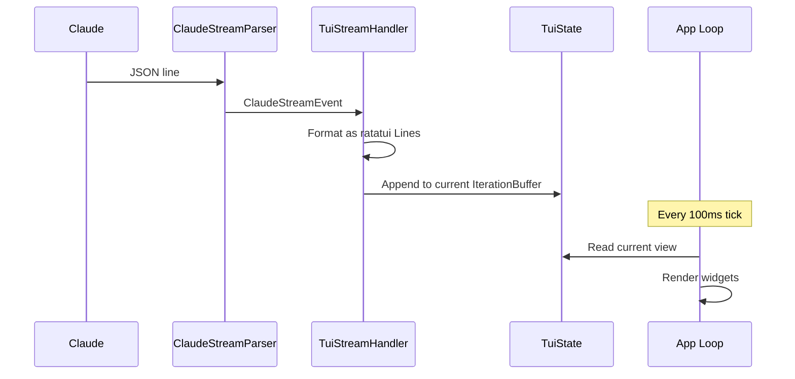
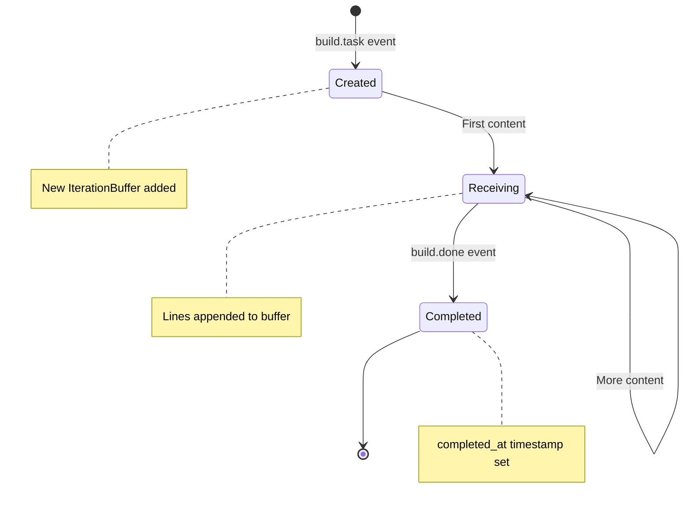

# TUI Refactor - Detailed Design

## Overview

This document describes the refactored TUI architecture for Ralph Orchestrator. The refactor simplifies the TUI from an interactive terminal emulator to a **read-only observation dashboard** that displays the same pretty output as non-TUI mode, enhanced with contextual widgets and iteration navigation.

### Goals

1. **Unified output**: TUI displays identical formatted output to non-TUI mode
2. **Observation-only**: No agent interaction—purely monitoring and review
3. **Iteration navigation**: Browse between iterations like browser tabs
4. **Simplification**: Remove VT100 parsing, input forwarding, complex mode state

### Non-Goals

- Interactive agent communication (removed)
- Raw terminal emulation (removed)
- Backward compatibility with current TUI behavior

---

## Detailed Requirements

### Core Requirements

| ID | Requirement | Source |
|----|-------------|--------|
| R1 | TUI displays same formatted output as `PrettyStreamHandler` | Q1 |
| R2 | Each iteration has isolated buffer, navigable via `←`/`→` | Q2 |
| R3 | Support scroll within iteration (`j`/`k`) and search (`/`) | Q3 |
| R4 | When viewing history, new iteration shows indicator, doesn't auto-jump | Q4 |
| R5 | Keep all iteration buffers in memory (no eviction) | Q5 |
| R6 | Header shows iteration position (e.g., `[iter 3/5]`), timing, hat | Existing |
| R7 | Footer shows activity indicator, last event, new iteration alert | Q4 |
| R8 | `q` or Ctrl+C exits TUI | Q3 |

### Removed Features

| Feature | Reason |
|---------|--------|
| Input forwarding to agent | Observation-only mode |
| VT100 terminal emulation | Using structured events instead |
| Prefix key system (Ctrl+A) | No modal input needed |
| tui-term dependency | No longer parsing raw PTY output |

---

## Architecture Overview

### High-Level Data Flow



### Component Architecture



---

## Components and Interfaces

### 1. TuiStreamHandler (new)

**Location:** `crates/ralph-adapters/src/stream_handler.rs`

Implements `StreamHandler` trait to receive structured events and format them for TUI display.

```rust
pub struct TuiStreamHandler {
    /// Shared state with TUI app
    state: Arc<Mutex<TuiState>>,
    /// Current text buffer being built
    text_buffer: String,
    /// Verbose mode (show tool results)
    verbose: bool,
}

impl StreamHandler for TuiStreamHandler {
    fn on_text(&mut self, text: &str);
    fn on_tool_call(&mut self, name: &str, id: &str, input: &Value);
    fn on_tool_result(&mut self, id: &str, output: &str);
    fn on_error(&mut self, error: &str);
    fn on_complete(&mut self, result: &SessionResult);
}
```

**Behavior:**
- Formats events identically to `PrettyStreamHandler` but outputs to `TuiState` instead of stdout
- Uses ratatui `Span`/`Line` types for styling (not ANSI escape codes)
- Appends formatted content to current iteration buffer

### 2. IterationBuffer (new)

**Location:** `crates/ralph-tui/src/state.rs`

Holds the formatted output for a single iteration.

```rust
pub struct IterationBuffer {
    /// Iteration number (1-indexed for display)
    pub number: u32,
    /// Formatted lines of output
    pub lines: Vec<Line<'static>>,
    /// Scroll position within this buffer
    pub scroll_offset: usize,
    /// Search state for this buffer
    pub search: Option<SearchState>,
    /// Timestamp when iteration started
    pub started_at: Instant,
    /// Timestamp when iteration completed (None if in progress)
    pub completed_at: Option<Instant>,
}
```

### 3. TuiState (modified)

**Location:** `crates/ralph-tui/src/state.rs`

Simplified state focused on observation.

```rust
pub struct TuiState {
    // --- Iteration management ---
    /// All iteration buffers
    pub iterations: Vec<IterationBuffer>,
    /// Currently viewed iteration index
    pub current_view: usize,
    /// Whether we're "following" the latest iteration
    pub following_latest: bool,

    // --- Header info (from event observer) ---
    pub current_hat: Option<(HatId, String)>,
    pub loop_started: Option<Instant>,
    pub max_iterations: Option<u32>,

    // --- Footer info ---
    pub last_event: Option<String>,
    pub last_event_at: Option<Instant>,

    // --- UI state ---
    pub show_help: bool,
    pub search_mode: bool,
    pub search_query: String,
}
```

**Removed fields:**
- `pending_hat` → replaced with `current_hat`
- `in_scroll_mode` → always scrollable
- `hat_map` → simplified lookup

### 4. Input Router (simplified)

**Location:** `crates/ralph-tui/src/input.rs`

Simplified from state machine to direct key handling.

```rust
pub enum Action {
    Quit,
    NextIteration,
    PrevIteration,
    ScrollUp,
    ScrollDown,
    ScrollTop,
    ScrollBottom,
    StartSearch,
    SearchNext,
    SearchPrev,
    ShowHelp,
    DismissHelp,
    None,
}

pub fn handle_key(key: KeyEvent, state: &TuiState) -> Action {
    match key.code {
        KeyCode::Char('q') => Action::Quit,
        KeyCode::Right | KeyCode::Char('l') => Action::NextIteration,
        KeyCode::Left | KeyCode::Char('h') => Action::PrevIteration,
        KeyCode::Down | KeyCode::Char('j') => Action::ScrollDown,
        KeyCode::Up | KeyCode::Char('k') => Action::ScrollUp,
        KeyCode::Char('g') => Action::ScrollTop,
        KeyCode::Char('G') => Action::ScrollBottom,
        KeyCode::Char('/') => Action::StartSearch,
        KeyCode::Char('n') => Action::SearchNext,
        KeyCode::Char('N') => Action::SearchPrev,
        KeyCode::Char('?') => Action::ShowHelp,
        KeyCode::Esc => Action::DismissHelp,
        _ => Action::None,
    }
}
```

### 5. ContentPane Widget (new)

**Location:** `crates/ralph-tui/src/widgets/content.rs`

Replaces `TerminalWidget`. Renders formatted text from iteration buffer.

```rust
pub struct ContentPane<'a> {
    buffer: &'a IterationBuffer,
    search_highlights: Option<&'a [Range<usize>]>,
}

impl Widget for ContentPane<'_> {
    fn render(self, area: Rect, buf: &mut Buffer) {
        // Render lines from buffer with scroll offset
        // Apply search highlighting if active
    }
}
```

### 6. Header Widget (modified)

**Location:** `crates/ralph-tui/src/widgets/header.rs`

Updated to show iteration navigation context.

```
┌─────────────────────────────────────────────────────────────────┐
│ [iter 3/5] 00:05:23 🔨 Builder                          [LIVE] │
└─────────────────────────────────────────────────────────────────┘
```

**Changes:**
- `[iter N]` → `[iter N/M]` showing position in history
- Mode indicator: `[LIVE]` when following latest, `[REVIEW]` when viewing history

### 7. Footer Widget (modified)

**Location:** `crates/ralph-tui/src/widgets/footer.rs`

Updated to show new iteration alerts.

```
┌─────────────────────────────────────────────────────────────────┐
│ ▶ New: iter 5    │    build.done                      ◉ active │
└─────────────────────────────────────────────────────────────────┘
```

**Changes:**
- Shows "▶ New: iter N" when new iteration starts while reviewing history
- Search query display when in search mode

---

## Data Models

### Event Flow



### Iteration Lifecycle



---

## Error Handling

| Error Case | Handling |
|------------|----------|
| Invalid UTF-8 in stream | Replace with � (replacement character) |
| Event parse failure | Log warning, skip event |
| Terminal resize | Re-render with new dimensions |
| Ctrl+C during operation | Clean exit, restore terminal |

---

## Testing Strategy

### Unit Tests

| Component | Test Focus |
|-----------|------------|
| `TuiStreamHandler` | Event formatting matches `PrettyStreamHandler` output |
| `IterationBuffer` | Scroll bounds, search highlighting |
| `Input Router` | Key → Action mapping |
| `TuiState` | Navigation logic, iteration management |

### Integration Tests

| Test | Description |
|------|-------------|
| Output parity | Compare TUI handler output to PrettyStreamHandler for same events |
| Iteration navigation | Create multiple buffers, verify navigation |
| Search functionality | Add content, search, verify highlights |

### Visual Validation

Use existing `/tui-validate` skill with updated criteria:
- `ralph-header`: Verify iteration counter format `[iter N/M]`
- `ralph-content`: Verify formatted output matches non-TUI
- `ralph-footer`: Verify new iteration indicator

---

## Appendices

### A. Technology Choices

| Choice | Rationale |
|--------|-----------|
| Keep ratatui | Existing investment, good fit for widgets |
| Remove tui-term | No longer need VT100 parsing |
| Native ratatui styling | Cleaner than ANSI escape codes in text |

### B. Research Findings

See `specs/tui-refactor/research/current-architecture.md` for detailed analysis of:
- Current TUI architecture (VT100-based)
- Current non-TUI architecture (StreamHandler-based)
- Key architectural differences that motivated this refactor

### C. Alternative Approaches Considered

| Approach | Why Not Chosen |
|----------|----------------|
| Redirect stdout | ANSI codes + ratatui mixing is fragile |
| Shared renderer | Larger refactoring scope, not needed initially |
| Keep VT100 + add widgets | Doesn't solve the "same output" requirement |

### D. Migration Notes

**Files to modify:**
- `crates/ralph-tui/src/lib.rs` - Public API changes
- `crates/ralph-tui/src/app.rs` - Simplified event loop
- `crates/ralph-tui/src/state.rs` - New state model
- `crates/ralph-tui/src/input.rs` - Simplified input handling
- `crates/ralph-tui/src/widgets/` - New ContentPane, updated Header/Footer

**Files to remove:**
- `crates/ralph-tui/src/widgets/terminal.rs` - VT100 widget no longer needed
- `crates/ralph-tui/src/scroll.rs` - Scroll logic moves into IterationBuffer

**Dependencies to remove:**
- `tui-term` crate - No longer needed

**Files to add:**
- `crates/ralph-adapters/src/stream_handler.rs` - Add `TuiStreamHandler`
- `crates/ralph-tui/src/widgets/content.rs` - New content pane widget
