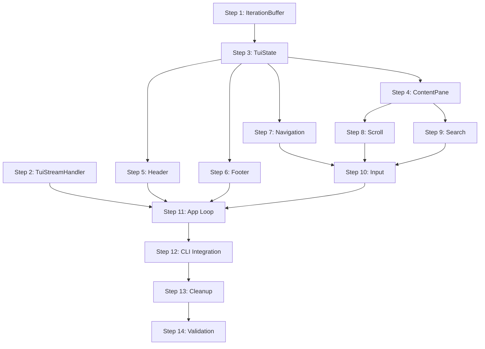

# TUI Refactor - Implementation Plan

## Implementation Checklist

- [ ] Step 1: Create IterationBuffer data structure
- [ ] Step 2: Create TuiStreamHandler
- [ ] Step 3: Refactor TuiState for iteration management
- [ ] Step 4: Create ContentPane widget
- [ ] Step 5: Update Header widget for iteration navigation
- [ ] Step 6: Update Footer widget for new iteration alerts
- [ ] Step 7: Implement iteration navigation
- [ ] Step 8: Implement scroll within iteration
- [ ] Step 9: Implement search functionality
- [ ] Step 10: Simplify input handling
- [ ] Step 11: Wire up App event loop
- [ ] Step 12: Update CLI integration
- [ ] Step 13: Remove deprecated code and dependencies
- [ ] Step 14: Final testing and validation

---

## Step 1: Create IterationBuffer Data Structure

**Objective:** Create the core data structure that holds formatted output for a single iteration.

**Implementation:**
- Create `IterationBuffer` struct in `crates/ralph-tui/src/state.rs`
- Include fields: `number`, `lines: Vec<Line<'static>>`, `scroll_offset`, `started_at`, `completed_at`
- Implement helper methods: `new()`, `append_line()`, `line_count()`, `visible_lines()`

**Test Requirements:**
- Unit test: Create buffer, append lines, verify line count
- Unit test: Verify scroll bounds calculation

**Integration:**
- This is a standalone data structure, no wiring needed yet

**Demo:** Run `cargo test -p ralph-tui iteration_buffer` — tests pass showing buffer correctly stores and retrieves lines.

---

## Step 2: Create TuiStreamHandler

**Objective:** Implement StreamHandler trait to format events identically to PrettyStreamHandler but output to TuiState.

**Implementation:**
- Add `TuiStreamHandler` struct in `crates/ralph-adapters/src/stream_handler.rs`
- Implement `StreamHandler` trait methods
- Format text using ratatui `Span` and `Line` types with styles (not ANSI)
- Mirror PrettyStreamHandler's formatting: tool icons (⚙️, ✓, ✗), colors, truncation

**Test Requirements:**
- Unit test: Verify `on_text()` produces correctly styled lines
- Unit test: Verify `on_tool_call()` formats as `⚙️ [ToolName] summary`
- Unit test: Verify `on_error()` formats with red styling
- Integration test: Compare output structure to PrettyStreamHandler for same events

**Integration:**
- Handler will receive `Arc<Mutex<TuiState>>` to push formatted lines

**Demo:** Run unit tests showing handler produces correctly formatted ratatui Lines for each event type.

---

## Step 3: Refactor TuiState for Iteration Management

**Objective:** Update TuiState to manage multiple iteration buffers and navigation state.

**Implementation:**
- Modify `TuiState` in `crates/ralph-tui/src/state.rs`
- Add fields: `iterations: Vec<IterationBuffer>`, `current_view: usize`, `following_latest: bool`
- Remove fields: `in_scroll_mode`, `pending_hat` (simplify to `current_hat`)
- Add methods: `current_iteration()`, `start_new_iteration()`, `navigate_to()`, `total_iterations()`

**Test Requirements:**
- Unit test: Start new iteration, verify buffer created
- Unit test: Navigate between iterations, verify current_view updates
- Unit test: Verify following_latest behavior

**Integration:**
- TuiStreamHandler will call `state.current_iteration_mut().append_line()`
- Event observer will call `state.start_new_iteration()` on `build.task`

**Demo:** Run `cargo test -p ralph-tui tui_state` — tests show iteration management works correctly.

---

## Step 4: Create ContentPane Widget

**Objective:** Create widget that renders formatted text from an IterationBuffer.

**Implementation:**
- Create `crates/ralph-tui/src/widgets/content.rs`
- Implement `ContentPane` struct with reference to `IterationBuffer`
- Implement ratatui `Widget` trait
- Handle scroll offset to show correct portion of buffer
- Support search highlighting (prepare for Step 9)

**Test Requirements:**
- Unit test: Render buffer with 10 lines in 5-line area, verify correct lines shown
- Unit test: Verify scroll offset affects which lines render

**Integration:**
- Replace `TerminalWidget` usage in app render loop
- Add to `widgets/mod.rs` exports

**Demo:** Manually construct a buffer with styled lines, render ContentPane, verify output appears correctly styled.

---

## Step 5: Update Header Widget for Iteration Navigation

**Objective:** Update header to show iteration position `[iter N/M]` and mode indicator.

**Implementation:**
- Modify `crates/ralph-tui/src/widgets/header.rs`
- Change iteration display from `[iter N]` to `[iter N/M]`
- Add mode indicator: `[LIVE]` when following latest, `[REVIEW]` when viewing history
- Update progressive disclosure priority if needed

**Test Requirements:**
- Unit test: Verify header shows correct iteration position
- Unit test: Verify mode indicator switches based on `following_latest`

**Integration:**
- Header reads from updated TuiState fields

**Demo:** Screenshot showing header with `[iter 2/5]` and `[REVIEW]` indicator.

---

## Step 6: Update Footer Widget for New Iteration Alerts

**Objective:** Update footer to show alert when new iteration starts while reviewing history.

**Implementation:**
- Modify `crates/ralph-tui/src/widgets/footer.rs`
- Add "▶ New: iter N" indicator when `!following_latest && new_iteration_available`
- Add field to TuiState: `new_iteration_alert: Option<u32>`
- Clear alert when user navigates to latest

**Test Requirements:**
- Unit test: Verify alert appears when conditions met
- Unit test: Verify alert clears after navigation

**Integration:**
- Footer reads `new_iteration_alert` from TuiState
- Navigation clears alert when reaching latest

**Demo:** Screenshot showing footer with "▶ New: iter 5" alert.

---

## Step 7: Implement Iteration Navigation

**Objective:** Allow user to navigate between iterations with arrow keys.

**Implementation:**
- Add `navigate_next()` and `navigate_prev()` methods to TuiState
- Update `following_latest` based on navigation
- Implement bounds checking (can't go below 1 or above total)

**Test Requirements:**
- Unit test: Navigate forward/backward, verify current_view
- Unit test: Verify can't navigate past bounds
- Unit test: Verify following_latest updates correctly

**Integration:**
- Input handler will call these methods (wired in Step 10)

**Demo:** With multiple iterations loaded, pressing `→` and `←` switches between them, header updates.

---

## Step 8: Implement Scroll Within Iteration

**Objective:** Allow user to scroll within current iteration buffer with j/k keys.

**Implementation:**
- Add `scroll_up()`, `scroll_down()`, `scroll_top()`, `scroll_bottom()` to IterationBuffer
- Implement bounds checking based on line count and viewport height
- Store viewport height in state for bounds calculation

**Test Requirements:**
- Unit test: Scroll down, verify offset increases
- Unit test: Verify can't scroll past end of content
- Unit test: Verify scroll_top/bottom work

**Integration:**
- Input handler will call these methods
- ContentPane uses scroll_offset when rendering

**Demo:** Long iteration output, pressing `j`/`k` scrolls content, `g`/`G` jumps to top/bottom.

---

## Step 9: Implement Search Functionality

**Objective:** Allow user to search within current iteration with `/` key.

**Implementation:**
- Add `SearchState` struct to IterationBuffer: `query`, `matches: Vec<(line, col)>`, `current_match`
- Implement `start_search()`, `execute_search()`, `next_match()`, `prev_match()`
- Update ContentPane to highlight search matches
- Add search input mode to capture query

**Test Requirements:**
- Unit test: Search for term, verify matches found
- Unit test: Navigate matches with n/N
- Unit test: Verify highlighting applied

**Integration:**
- Input handler enters search mode on `/`
- Footer shows search query while typing

**Demo:** Press `/`, type query, see matches highlighted, `n`/`N` navigates between matches.

---

## Step 10: Simplify Input Handling

**Objective:** Replace complex mode state machine with simple key→action mapping.

**Implementation:**
- Rewrite `crates/ralph-tui/src/input.rs`
- Remove `InputRouter` state machine, prefix key handling
- Create simple `handle_key(KeyEvent, &TuiState) -> Action` function
- Define `Action` enum: Quit, NextIteration, PrevIteration, ScrollUp, etc.

**Test Requirements:**
- Unit test: Each key maps to correct action
- Unit test: Search mode key handling

**Integration:**
- App event loop calls `handle_key()` and matches on Action

**Demo:** Press various keys, correct actions execute without prefix key needed.

---

## Step 11: Wire Up App Event Loop

**Objective:** Integrate all components into the main application loop.

**Implementation:**
- Refactor `crates/ralph-tui/src/app.rs`
- Remove PTY input forwarding
- Simplify to: render tick (100ms) + keyboard input + stream events
- Use `tokio::select!` for event multiplexing
- Render: Header + ContentPane + Footer (+ HelpOverlay if shown)

**Test Requirements:**
- Integration test: App starts, receives events, renders correctly
- Integration test: Keyboard input triggers correct actions

**Integration:**
- This is where everything comes together

**Demo:** Run TUI with mock event stream, see formatted output appear, navigate iterations, scroll, search.

---

## Step 12: Update CLI Integration

**Objective:** Wire TuiStreamHandler into the CLI's TUI mode path.

**Implementation:**
- Modify `crates/ralph-cli/src/main.rs` TUI initialization (~line 1594)
- Create `TuiStreamHandler` instead of/alongside PTY setup
- Pass handler to `run_observe_streaming()` or equivalent
- Ensure event observer still updates TuiState for header/footer info

**Test Requirements:**
- Smoke test: Run `ralph run --tui` with a simple prompt
- Verify output matches non-TUI mode formatting

**Integration:**
- Final wiring between ralph-cli, ralph-adapters, and ralph-tui

**Demo:** Run `ralph run --tui -c ralph.yml -p "hello"` — see same pretty output as non-TUI, with header/footer context.

---

## Step 13: Remove Deprecated Code and Dependencies

**Objective:** Clean up code no longer needed after refactor.

**Implementation:**
- Delete `crates/ralph-tui/src/widgets/terminal.rs`
- Delete or gut `crates/ralph-tui/src/scroll.rs` (logic moved to IterationBuffer)
- Remove `tui-term` from `Cargo.toml` dependencies
- Remove unused imports and dead code
- Update `widgets/mod.rs` exports

**Test Requirements:**
- `cargo build` succeeds with no warnings
- `cargo test` all pass
- `cargo clippy` clean

**Integration:**
- N/A - cleanup only

**Demo:** `cargo build` succeeds, binary size reduced, no deprecation warnings.

---

## Step 14: Final Testing and Validation

**Objective:** Comprehensive testing and validation of the refactored TUI.

**Implementation:**
- Run full smoke test suite: `cargo test -p ralph-core smoke_runner`
- Run TUI validation: `/tui-validate` with updated criteria
- Manual testing: multiple iterations, navigation, search, edge cases
- Update `specs/terminal-ui.spec.md` to reflect new architecture

**Test Requirements:**
- All existing tests pass
- New unit tests pass
- TUI visual validation passes
- Manual testing checklist complete

**Integration:**
- Update documentation and specs

**Demo:** Full end-to-end demo: run ralph with TUI, show iteration navigation, search, same output as non-TUI. Record with asciinema for PR.

---

## Dependencies Between Steps

## Estimated Scope

| Step | Files Modified | Complexity |
|------|----------------|------------|
| 1 | 1 | Low |
| 2 | 1 | Medium |
| 3 | 1 | Medium |
| 4 | 2 | Medium |
| 5 | 1 | Low |
| 6 | 1 | Low |
| 7 | 1 | Low |
| 8 | 1 | Low |
| 9 | 2 | Medium |
| 10 | 1 | Medium |
| 11 | 1 | High |
| 12 | 1 | Medium |
| 13 | 4 | Low |
| 14 | 2 | Low |
