# Task: Enhance HATS Section with Ralph Row, Descriptions, and Topology Diagram

## Description
Enhance the HATS section in HatlessRalph prompts to provide comprehensive routing context. Add a required `description` field to hat configs, include Ralph as a coordinator row in the table, and generate a Mermaid diagram showing event flow. This gives Ralph full visibility into why and how to delegate work.

## Background
Currently the HATS section only shows a routing table without Ralph itself or context about what each hat does. Ralph needs to understand:
- **Where** events route (the table)
- **Why** to choose each hat (descriptions)
- **How** events flow (Mermaid diagram)

The topology should also be validated to catch configuration errors like unreachable hats.

## Technical Requirements

1. **Add `description` field to hat config schema**
   - Required string field in `Hat` struct
   - Config validation fails if missing
   - Short, single-line purpose statement

2. **Update all presets with descriptions**
   - Every hat in `presets/**/*.yml` needs a `description`
   - Extract purpose from existing instructions or write concise summary

3. **Add Ralph coordinator row to HATS table**
   - Ralph's "Triggers On" = `task.start` + all hats' `publishes`
   - Ralph's "Publishes" = all hats' `subscribes_to`
   - Ralph's "Description" = "Coordinates workflow, delegates to specialized hats"

4. **Combined table format**
   ```
   | Hat | Triggers On | Publishes | Description |
   |-----|-------------|----------|-------------|
   | Ralph | task.start, build.done, build.blocked | build.task | Coordinates workflow, delegates to specialized hats |
   | Builder | build.task | build.done, build.blocked | Implements code. One task, one commit. |
   ```

5. **Generate Mermaid topology diagram**
   - Flowchart showing event flow between hats
   - `task.start` as entry node
   - Edges labeled with event names
   - Placed after the table in prompt

6. **Topology validation**
   - Validate all hats reachable from `task.start`
   - Warn (don't error) on orphan hats or unreachable nodes
   - Log warning during prompt generation

## Dependencies
- `crates/ralph-core/src/hatless_ralph.rs` - HatlessRalph and `hats_section()`
- `crates/ralph-core/src/config.rs` - Hat config struct
- `crates/ralph-proto/src/lib.rs` - Hat proto definition (if separate)
- All files in `presets/` directory

## Implementation Approach

1. **Schema change**: Add `description: String` to Hat struct, update serde
2. **Validation**: Add check in config loading for required description
3. **Update presets**: Add description to every hat in all preset files
4. **Ralph row**: In `hats_section()`, derive Ralph's triggers/publishes from topology
5. **Table format**: Update table generation to include Description column
6. **Mermaid generation**: New function to generate flowchart from topology
7. **Validation**: Graph traversal from task.start to check reachability
8. **Tests**: Update existing tests, add new tests for each feature

## Acceptance Criteria

1. **Description field required**
   - Given a hat config without `description`
   - When loading the config
   - Then validation fails with clear error message

2. **All presets have descriptions**
   - Given any preset in `presets/` directory
   - When loaded
   - Then all hats have non-empty descriptions

3. **Ralph row appears in table**
   - Given a config with hats
   - When generating the HATS section
   - Then Ralph appears as first row with derived triggers/publishes

4. **Ralph triggers derived correctly**
   - Given hats that publish `build.done`, `build.blocked`
   - When generating Ralph row
   - Then Ralph's "Triggers On" = `task.start, build.done, build.blocked`

5. **Ralph publishes derived correctly**
   - Given hats that trigger on `build.task`, `review.request`
   - When generating Ralph row
   - Then Ralph's "Publishes" = `build.task, review.request`

6. **Combined table includes descriptions**
   - Given hats with descriptions
   - When generating HATS section
   - Then table has 4 columns: Hat, Triggers On, Publishes, Description

7. **Mermaid diagram generated**
   - Given a multi-hat config
   - When generating HATS section
   - Then valid Mermaid flowchart appears after table

8. **Mermaid shows correct flow**
   - Given feature.yml config (Builder, Reviewer)
   - When generating diagram
   - Then edges show: task.start→Ralph, Ralph→Builder, Builder→Ralph, etc.

9. **Unreachable hat warning**
   - Given a hat that triggers on event nothing publishes
   - When generating HATS section
   - Then warning is logged (but prompt still generated)

10. **Existing tests pass**
    - Given the changes
    - When running `cargo test`
    - Then all existing hatless_ralph tests pass (updated as needed)

## Example Outputs

### feature.yml
```markdown
## HATS

Delegate via events.

| Hat | Triggers On | Publishes | Description |
|-----|-------------|----------|-------------|
| Ralph | task.start, build.done, build.blocked, review.approved, review.changes_requested | build.task, review.request | Coordinates workflow, delegates to specialized hats |
| Builder | build.task | build.done, build.blocked | Implements code. One task, one commit. Runs backpressure. |
| Reviewer | review.request | review.approved, review.changes_requested | Reviews for correctness, tests, patterns. Does NOT modify code. |


```

### tdd-red-green.yml
```markdown
## HATS

Delegate via events.

| Hat | Triggers On | Publishes | Description |
|-----|-------------|----------|-------------|
| Ralph | task.start, test.written, test.passing, refactor.done, cycle.complete | tdd.start, test.written, test.passing | Coordinates TDD cycle |
| 🔴 Test Writer | tdd.start, refactor.done | test.written | Writes FAILING tests first. Never implements. |
| 🟢 Implementer | test.written | test.passing | Makes test pass with MINIMAL code. No refactoring. |
| 🔵 Refactorer | test.passing | refactor.done, cycle.complete | Cleans up code while keeping tests green. |

```mermaid
flowchart LR
    task.start((task.start)) --> Ralph
    Ralph -->|tdd.start| TestWriter[🔴 Test Writer]
    TestWriter -->|test.written| Implementer[🟢 Implementer]
    Implementer -->|test.passing| Refactorer[🔵 Refactorer]
    Refactorer -->|refactor.done| TestWriter
    Refactorer -->|cycle.complete| Ralph
```


```

## Metadata
- **Complexity**: Medium
- **Labels**: hatless-ralph, config, topology, prompt-engineering, presets
- **Required Skills**: Rust, YAML, Mermaid syntax, graph traversal
