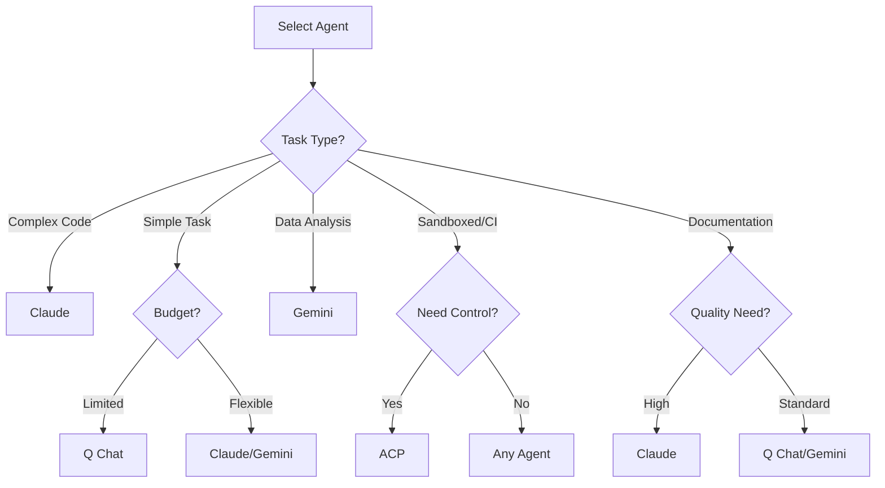

# AI Agents Guide

Ralph Orchestrator supports multiple AI agents, each with unique capabilities and cost structures. This guide helps you choose and configure the right agent for your task.

## Supported Agents

### Claude (Anthropic)

Claude is Anthropic's advanced AI assistant, known for nuanced understanding and high-quality outputs.

**Strengths:**
- Excellent code generation and debugging
- Strong reasoning and analysis
- Comprehensive documentation writing
- Ethical and safe responses
- Large context window (200K tokens)

**Best For:**
- Complex software development
- Technical documentation
- Research and analysis
- Creative writing
- Problem-solving requiring deep reasoning

**Installation:**
```bash
npm install -g @anthropic-ai/claude-cli
```

**Usage:**
```bash
python ralph_orchestrator.py --agent claude
```

**Cost:**
- Input: $3.00 per million tokens
- Output: $15.00 per million tokens

### Q Chat

Q Chat is a cost-effective AI assistant suitable for many general tasks, with a solid adapter implementation.

**Strengths:**
- Good general-purpose capabilities
- Fast response times with streaming support
- Cost-effective for simple tasks
- Reliable for straightforward operations
- Thread-safe concurrent message processing
- Robust error handling and recovery
- Graceful shutdown and resource cleanup

**Best For:**
- Simple coding tasks
- Basic documentation
- Data processing
- Quick prototypes
- Budget-conscious operations
- High-concurrency workloads
- Long-running batch processes

**Installation:**
```bash
pip install q-cli
```

**Usage:**
```bash
python ralph_orchestrator.py --agent q

# Short form
python ralph_orchestrator.py -a q
```

**Operational Features:**
- **Message Queue**: Thread-safe async message processing
- **Error Recovery**: Automatic retry with exponential backoff
- **Signal Handling**: Graceful shutdown on SIGINT/SIGTERM
- **Resource Management**: Proper cleanup of processes and threads
- **Timeout Handling**: Configurable timeouts with partial output preservation
- **Non-blocking I/O**: Prevents deadlocks in pipe communication
- **Concurrent Processing**: Handles multiple requests simultaneously

**Cost:**
- Input: $0.50 per million tokens (estimated)
- Output: $1.50 per million tokens (estimated)

### Gemini (Google)

Google's Gemini offers strong capabilities with multimodal understanding.

**Strengths:**
- Excellent at data analysis
- Strong mathematical capabilities
- Good code understanding
- Multimodal capabilities (Pro version)
- Competitive pricing

**Best For:**
- Data science tasks
- Mathematical computations
- Code analysis
- Research tasks
- Multi-language support

**Installation:**
```bash
pip install google-generativeai
```

**Usage:**
```bash
python ralph_orchestrator.py --agent gemini
```

**Cost:**
- Input: $0.50 per million tokens
- Output: $1.50 per million tokens

### ACP (Agent Client Protocol)

ACP enables integration with any agent that implements the [Agent Client Protocol](https://github.com/anthropics/agent-client-protocol). This provides a standardized way to communicate with AI agents regardless of their underlying implementation.

**Strengths:**
- Works with any ACP-compliant agent
- Standardized JSON-RPC 2.0 protocol
- Flexible permission handling (4 modes)
- File and terminal operation support
- Session persistence via scratchpad
- Streaming update support

**Best For:**
- Using multiple agent backends
- Custom agent implementations
- Sandboxed execution environments
- CI/CD pipelines with controlled permissions
- Enterprise deployments with security requirements

**Installation:**
```bash
# Gemini CLI with ACP support
npm install -g @google/gemini-cli

# Any other ACP-compliant agent
# Follow the agent's installation instructions
```

**Usage:**
```bash
# Basic ACP usage with Gemini
python ralph_orchestrator.py --agent acp --acp-agent gemini

# With specific permission mode
python ralph_orchestrator.py --agent acp --acp-agent gemini --acp-permission-mode auto_approve

# Using allowlist mode
python ralph_orchestrator.py --agent acp --acp-permission-mode allowlist
```

**Permission Modes:**

| Mode | Description | Use Case |
|------|-------------|----------|
| `auto_approve` | Approve all requests automatically | Trusted environments, CI/CD |
| `deny_all` | Deny all permission requests | Testing, sandboxed execution |
| `allowlist` | Only approve matching patterns | Production with specific tools |
| `interactive` | Prompt user for each request | Development, manual oversight |

**Configuration (ralph.yml):**
```yaml
adapters:
  acp:
    enabled: true
    timeout: 300
    tool_permissions:
      agent_command: gemini
      agent_args: []
      permission_mode: auto_approve
      permission_allowlist:
        - "fs/read_text_file:*.py"
        - "fs/write_text_file:src/*"
        - "terminal/create:pytest*"
```

**Environment Variables:**
```bash
export RALPH_ACP_AGENT=gemini
export RALPH_ACP_PERMISSION_MODE=auto_approve
export RALPH_ACP_TIMEOUT=300
```

**Supported Operations:**

| Operation | Description |
|-----------|-------------|
| `fs/read_text_file` | Read file contents (with path security) |
| `fs/write_text_file` | Write file contents (with path security) |
| `terminal/create` | Create subprocess with command |
| `terminal/output` | Read process output |
| `terminal/wait_for_exit` | Wait for process completion |
| `terminal/kill` | Terminate process |
| `terminal/release` | Release terminal resources |

**Cost:**
- Input: $0.00 (billing handled by underlying agent)
- Output: $0.00 (billing handled by underlying agent)

**Note:** Claude CLI does not currently support native ACP mode. For Claude, use the native `ClaudeAdapter` (`--agent claude`) instead.

## Auto-Detection

Ralph Orchestrator can automatically detect and use available agents:

```bash
python ralph_orchestrator.py --agent auto
```

**Detection Order:**
1. Claude (if installed)
2. Q Chat (if installed)
3. Gemini (if installed)

## Agent Comparison

| Feature | Claude | Q Chat | Gemini | ACP |
|---------|--------|--------|---------|-----|
| **Context Window** | 200K | 100K | 128K | Varies |
| **Code Quality** | Excellent | Good | Very Good | Varies |
| **Documentation** | Excellent | Good | Good | Varies |
| **Speed** | Moderate | Fast | Fast | Varies |
| **Cost** | High | Low | Low | Agent-dependent |
| **Reasoning** | Excellent | Good | Very Good | Varies |
| **Creativity** | Excellent | Good | Good | Varies |
| **Math/Data** | Very Good | Good | Excellent | Varies |
| **Permission Control** | Basic | Basic | Basic | **4 modes** |
| **Protocol** | SDK | CLI | CLI | JSON-RPC 2.0 |

## Choosing the Right Agent

### Decision Tree



### Task-Agent Mapping

| Task Type | Recommended Agent | Alternative |
|-----------|------------------|-------------|
| **Web API Development** | Claude | Gemini |
| **CLI Tool Creation** | Claude | Q Chat |
| **Data Processing** | Gemini | Claude |
| **Documentation** | Claude | Gemini |
| **Testing** | Claude | Q Chat |
| **Refactoring** | Claude | Gemini |
| **Simple Scripts** | Q Chat | Gemini |
| **Research** | Claude | Gemini |
| **Prototyping** | Q Chat | Gemini |
| **Production Code** | Claude | - |
| **CI/CD Pipelines** | ACP | Claude |
| **Sandboxed Execution** | ACP | - |
| **Multi-Agent Workflows** | ACP | - |

## Agent Configuration

### Claude Configuration

```bash
# Standard Claude usage
python ralph_orchestrator.py --agent claude

# With specific model
python ralph_orchestrator.py \
  --agent claude \
  --agent-args "--model claude-3-sonnet-20240229"

# With custom parameters
python ralph_orchestrator.py \
  --agent claude \
  --agent-args "--temperature 0.7 --max-tokens 4096"
```

### Q Chat Configuration

```bash
# Standard Q usage
python ralph_orchestrator.py --agent q

# With custom parameters
python ralph_orchestrator.py \
  --agent q \
  --agent-args "--context-length 50000"

# Production configuration with enhanced settings
python ralph_orchestrator.py \
  --agent q \
  --max-iterations 100 \
  --retry-delay 2 \
  --checkpoint-interval 10 \
  --verbose

# High-concurrency configuration
python ralph_orchestrator.py \
  --agent q \
  --agent-args "--async --timeout 300" \
  --max-iterations 200
```

**Environment Variables:**
```bash
# Set Q chat timeout (default: 120 seconds)
export QCHAT_TIMEOUT=300

# Enable verbose logging
export QCHAT_VERBOSE=1

# Configure retry attempts
export QCHAT_MAX_RETRIES=5
```

### Gemini Configuration

```bash
# Standard Gemini usage
python ralph_orchestrator.py --agent gemini

# With specific model
python ralph_orchestrator.py \
  --agent gemini \
  --agent-args "--model gemini-pro"
```

### ACP Configuration

```bash
# Standard ACP usage with Gemini
python ralph_orchestrator.py --agent acp --acp-agent gemini

# With custom permission mode
python ralph_orchestrator.py \
  --agent acp \
  --acp-agent gemini \
  --acp-permission-mode allowlist

# Production configuration
python ralph_orchestrator.py \
  --agent acp \
  --acp-agent gemini \
  --acp-permission-mode auto_approve \
  --max-iterations 100 \
  --checkpoint-interval 10 \
  --verbose
```

**Configuration File (ralph.yml):**
```yaml
adapters:
  acp:
    enabled: true
    timeout: 300
    tool_permissions:
      agent_command: gemini
      agent_args: ["--experimental-acp"]
      permission_mode: auto_approve
      permission_allowlist: []
```

**Environment Variables:**
```bash
# Override agent command
export RALPH_ACP_AGENT=gemini

# Override permission mode
export RALPH_ACP_PERMISSION_MODE=auto_approve

# Override timeout
export RALPH_ACP_TIMEOUT=300
```

## Agent-Specific Features

### Claude Features

- **Constitutional AI**: Built-in safety and ethics
- **Code Understanding**: Deep comprehension of complex codebases
- **Long Context**: Handles up to 200K tokens
- **Nuanced Responses**: Understands subtle requirements

```bash
# Leverage Claude's long context
python ralph_orchestrator.py \
  --agent claude \
  --context-window 200000 \
  --context-threshold 0.9
```

### Q Chat Features

- **Speed**: Fast response times with streaming support
- **Efficiency**: Lower resource usage with optimized memory management
- **Simplicity**: Straightforward for basic tasks
- **Concurrency**: Thread-safe operations for parallel processing
- **Reliability**: Automatic error recovery and retry mechanisms
- **Production-Ready**: Signal handling, graceful shutdown, resource cleanup

**Production Capabilities:**
```bash
# Quick iterations with Q
python ralph_orchestrator.py \
  --agent q \
  --max-iterations 100 \
  --retry-delay 1

# Async execution with timeout
python ralph_orchestrator.py \
  --agent q \
  --agent-args "--async --timeout 300" \
  --checkpoint-interval 10

# Stress testing configuration
python ralph_orchestrator.py \
  --agent q \
  --max-iterations 500 \
  --metrics-interval 10 \
  --verbose

# Long-running batch processing
python ralph_orchestrator.py \
  --agent q \
  --checkpoint-interval 5 \
  --max-cost 50.0 \
  --retry-delay 5
```

**Monitoring and Logging:**
- Thread-safe logging for concurrent operations
- Detailed error messages with stack traces
- Performance metrics collection
- Resource usage tracking
- Message queue status monitoring

### Gemini Features

- **Data Excellence**: Superior at data tasks
- **Mathematical Prowess**: Strong calculation abilities
- **Multi-language**: Good support for various programming languages

```bash
# Data processing with Gemini
python ralph_orchestrator.py \
  --agent gemini \
  --prompt data_analysis.md
```

### ACP Features

- **Protocol Standardization**: JSON-RPC 2.0 communication
- **Permission Control**: Four modes for fine-grained access control
- **File Operations**: Secure read/write with path validation
- **Terminal Operations**: Full subprocess lifecycle management
- **Session Persistence**: Scratchpad for cross-iteration context
- **Streaming Updates**: Real-time agent output and thoughts

**Permission Mode Examples:**
```bash
# Auto-approve all requests (CI/CD)
python ralph_orchestrator.py \
  --agent acp \
  --acp-agent gemini \
  --acp-permission-mode auto_approve

# Deny all requests (testing)
python ralph_orchestrator.py \
  --agent acp \
  --acp-agent gemini \
  --acp-permission-mode deny_all

# Interactive approval (development)
python ralph_orchestrator.py \
  --agent acp \
  --acp-agent gemini \
  --acp-permission-mode interactive
```

**Allowlist Pattern Examples:**
```yaml
# ralph.yml
adapters:
  acp:
    tool_permissions:
      permission_mode: allowlist
      permission_allowlist:
        # Exact match
        - "fs/read_text_file"
        # Glob patterns
        - "fs/*"
        - "terminal/create:pytest*"
        # Regex patterns (surrounded by slashes)
        - "/^fs\\/.*$/"
```

**Agent Scratchpad:**
All agents maintain context across iterations via `.agent/scratchpad.md`:
- Persists progress from previous iterations
- Records decisions and context
- Tracks current blockers or issues
- Lists remaining work items

```bash
# The scratchpad is automatically managed
cat .agent/scratchpad.md
```

## Multi-Agent Strategies

### Sequential Processing

Process with different agents for different phases:

```bash
# Phase 1: Research with Claude
python ralph_orchestrator.py --agent claude --prompt research.md

# Phase 2: Implementation with Q
python ralph_orchestrator.py --agent q --prompt implement.md

# Phase 3: Documentation with Claude
python ralph_orchestrator.py --agent claude --prompt document.md
```

### Cost Optimization

Start with cheaper agents, escalate if needed:

```bash
# Try Q first
python ralph_orchestrator.py --agent q --max-cost 2.0

# If unsuccessful, try Claude
python ralph_orchestrator.py --agent claude --max-cost 20.0
```

## Agent Performance Tuning

### Claude Optimization

```bash
# Optimized for quality
python ralph_orchestrator.py \
  --agent claude \
  --max-iterations 50 \
  --checkpoint-interval 5 \
  --context-window 200000

# Optimized for speed
python ralph_orchestrator.py \
  --agent claude \
  --max-iterations 20 \
  --retry-delay 1
```

### Q Chat Optimization

```bash
# Maximum efficiency
python ralph_orchestrator.py \
  --agent q \
  --max-iterations 200 \
  --checkpoint-interval 20 \
  --metrics-interval 50
```

### Gemini Optimization

```bash
# Data-heavy tasks
python ralph_orchestrator.py \
  --agent gemini \
  --context-window 128000 \
  --max-tokens 500000
```

## Troubleshooting Agents

### Common Issues

1. **Agent Not Found**
   ```bash
   # Check installation
   which claude  # or q, gemini
   
   # Use auto-detection
   python ralph_orchestrator.py --agent auto --dry-run
   ```

2. **Rate Limiting**
   ```bash
   # Increase retry delay
   python ralph_orchestrator.py --retry-delay 10
   ```

3. **Context Overflow**
   ```bash
   # Adjust context settings
   python ralph_orchestrator.py \
     --context-window 100000 \
     --context-threshold 0.7
   ```

4. **Poor Output Quality**
   ```bash
   # Switch to higher-quality agent
   python ralph_orchestrator.py --agent claude
   ```

### Agent Diagnostics

```bash
# Test agent availability
python ralph_orchestrator.py --agent auto --dry-run --verbose

# Check agent performance
python ralph_orchestrator.py \
  --agent claude \
  --max-iterations 1 \
  --verbose \
  --metrics-interval 1
```

## Cost Management by Agent

### Budget Allocation

```bash
# Low budget: Use Q
python ralph_orchestrator.py --agent q --max-cost 5.0

# Medium budget: Use Gemini
python ralph_orchestrator.py --agent gemini --max-cost 25.0

# High budget: Use Claude
python ralph_orchestrator.py --agent claude --max-cost 100.0
```

### Cost Tracking

Monitor costs per agent:

```bash
# Enable detailed metrics
python ralph_orchestrator.py \
  --agent claude \
  --metrics-interval 1 \
  --verbose
```

## Best Practices

### 1. Match Agent to Task

- **Complex logic**: Use Claude
- **Simple tasks**: Use Q Chat
- **Data work**: Use Gemini

### 2. Start Small

Test with few iterations first:

```bash
python ralph_orchestrator.py --agent auto --max-iterations 5
```

### 3. Monitor Performance

Track metrics for optimization:

```bash
python ralph_orchestrator.py --metrics-interval 5 --verbose
```

### 4. Use Auto-Detection

Let the system choose when unsure:

```bash
python ralph_orchestrator.py --agent auto
```

### 5. Consider Costs

Balance quality with budget:

- Development: Use Q Chat
- Testing: Use Gemini
- Production: Use Claude

## Next Steps

- Master [Prompt Engineering](prompts.md) for better results
- Learn about [Cost Management](cost-management.md)
- Understand [Checkpointing](checkpointing.md) strategies
- Explore [Configuration](configuration.md) options
